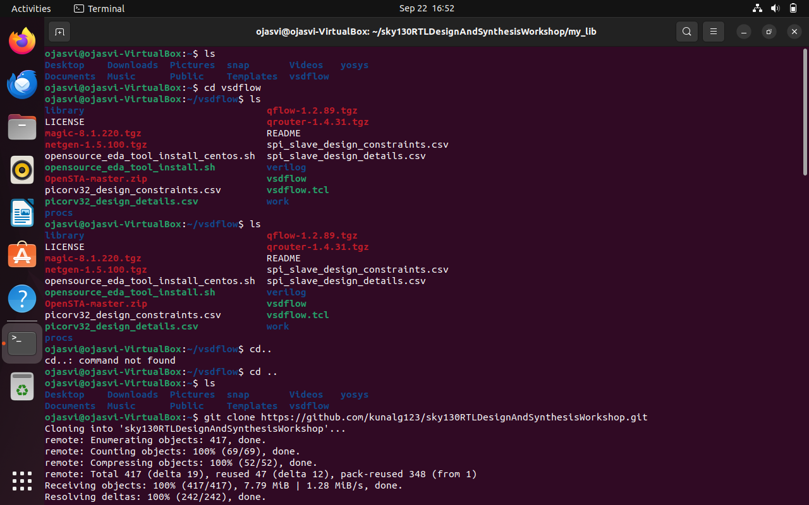
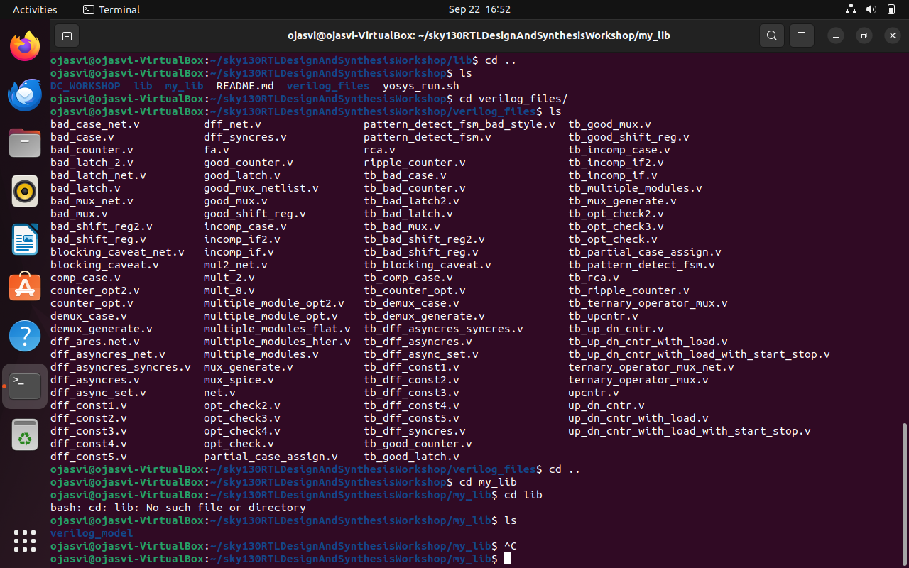
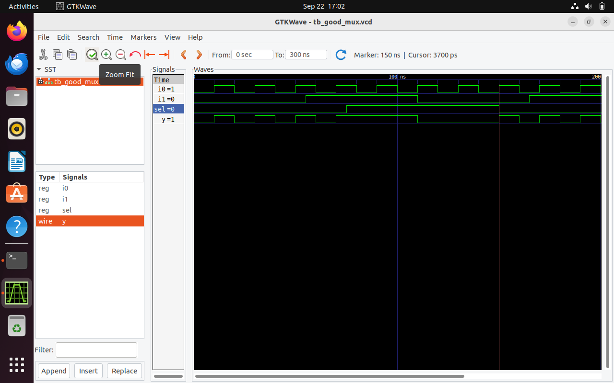
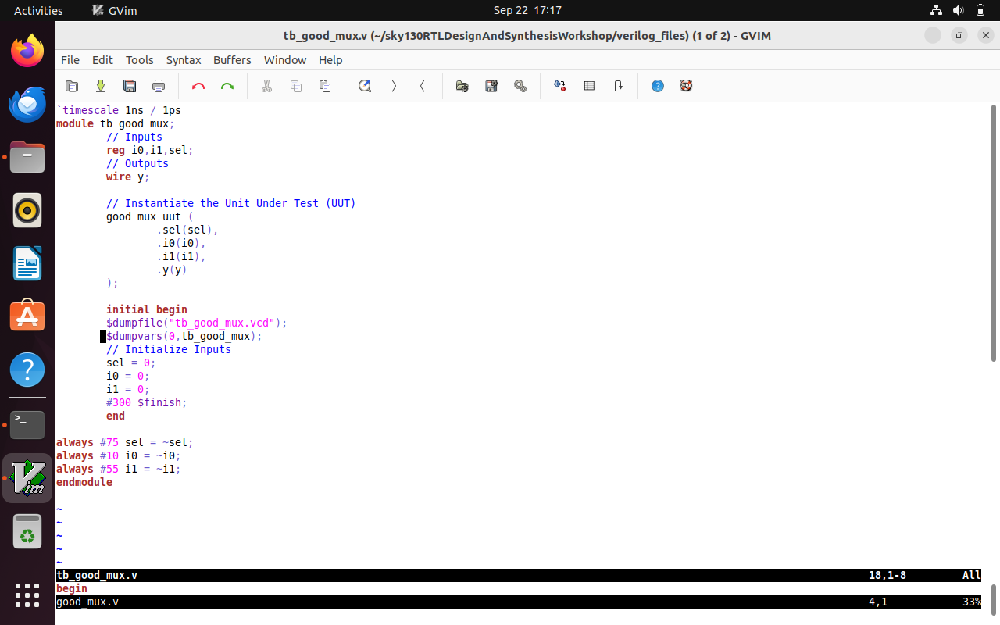
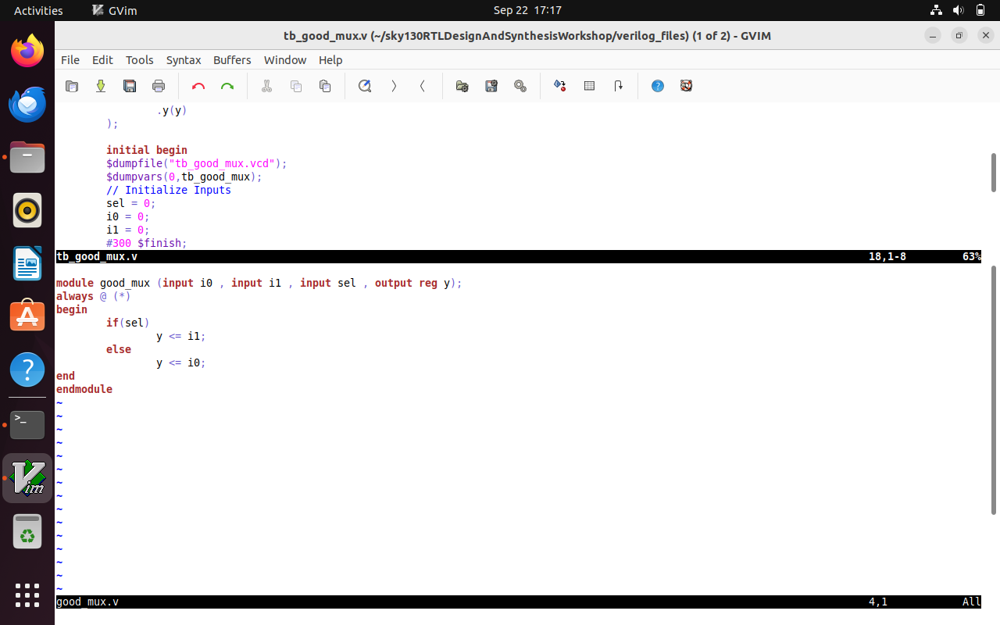

# Week1 Day1:Introduction to verilog RTL design and synthesis (using Yosys, Iverilog , Gtkwave)

Day1 consist of some RTL design , simulations(iverilog) , testbench creation and synthesis (converting RTL to netlist via yosys).

RTL design stands for Register Transfer Level Design,which is a very crucial step.It tells how data flows between registers and how logical operation are done via RTL , which makes the foundation for chip design , synthesis and verification processes.

## Setting libraries and verilog files
We will begin with cloning of 2 repositories vsdflow(https://github.com/kunalg123/vsdflow) and sky130RTLDesignAndSynthesisWorkshop(https://github.com/kunalg123/sky130RTLDesignAndSynthesisWorkshop) which have the required files and libraries that we would need to do simulation and logic synthesis .
```bash
$ git clone https://github.com/kunalg123/vsdflow.git 
$ git clone https://github.com/kunalg123/sky130RTLDesignAndSynthesisWorkshop
```



## Iverilog simulation of mux
Now when you already did cloning after that first lets open RTL design in gtkwave via creation of testbench.
```bash
$ iverilog good_mux.v tb_good_mux.v
$ ./a.out
$ gtkwave tb_good_mux.vcd
```


Now to open .v files , make sure to install gvim 
```bash
$ gvim tb_good_mux.v -o good_mux.v
```



## Yosys simulation
After you are done with RTL design with testbench using yosys as synthesizer.
```bash
$yosys                                                                             
yosys> read_liberty -lib ../my_lib/lib/sky130_fd_sc_hd__tt_025C_1v80.lib           
yosys> read_verilog good_mux.v                                                     
yosys> synth -top good_mux                                                          
yosys> abc -liberty ../my_lib/lib/sky130_fd_sc_hd__tt_025C_1v80.lib                     
yosys> show
```
