# Week1 Day2:Hierarchical vs Flat Synthesis and Various flop coding styles 

Day2 consist of some working on multiple_modules.v and its subsequent sub-modules.

Now first lets go on meaning of one of the library sky130_fd_sc_hd_tt_025C_1v80.lib.Whereas fd denotes foundry ,sd denotes standard cell ,hd denotes high density, tt denotes typical process ,025C denotes temperature and 1v80 denotes voltage.(tt_025C_1v80 called as process, temperature and voltage)

## Hierarchical vs Flat Synthesis
We will begin with multiple_module.v
```bash
$ gvim multiple_modules.v
```


```bash
$yosys                                                                             
yosys> read_liberty -lib ../my_lib/lib/sky130_fd_sc_hd__tt_025C_1v80.lib           
yosys> read_verilog good_mux.v                                                     
yosys> synth -top good_mux
```
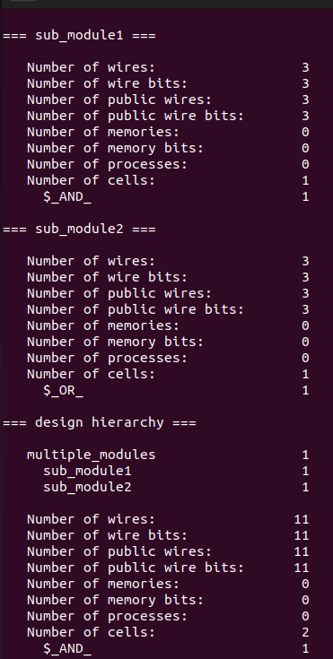
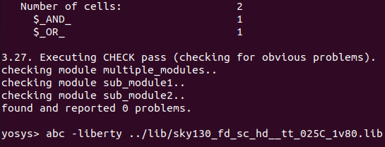

```bash                                                         
yosys> abc -liberty ../my_lib/lib/sky130_fd_sc_hd__tt_025C_1v80.lib                     
yosys> show multiple_modules
```
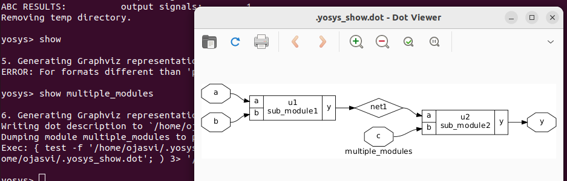
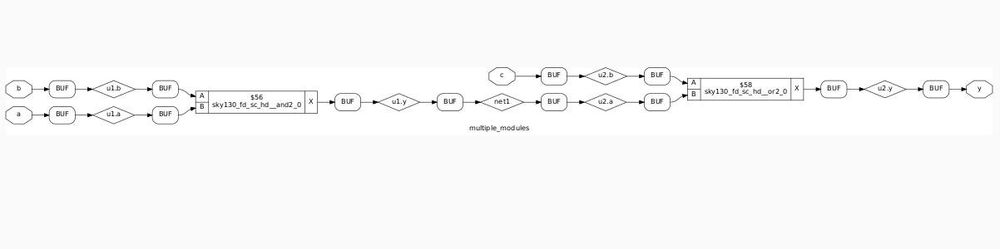

```bash                                                         
yosys> write_verilog -noattr multiple_modules_hier.v                   
yosys> !gvim multiple_modules_hier.v
```
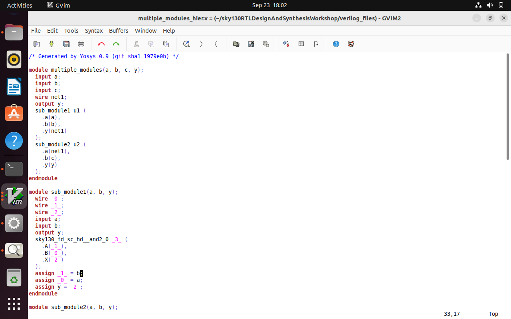
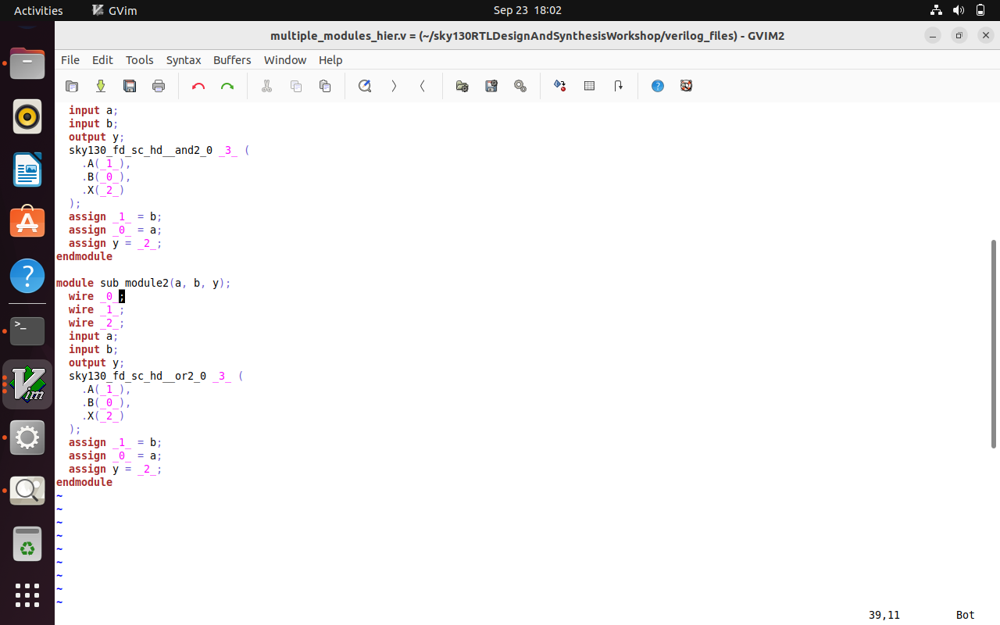

### Remember you need to flatten these multiple modules because of that yosys> !gvim -noattr multiple_modules_hier.v is causing error once you do flatten no error comes.
```bash
yosys>flatten                                                    
yosys> write_verilog -noattr multiple_modules_hier.v                   
yosys> !gvim multiple_modules_hier.v
```
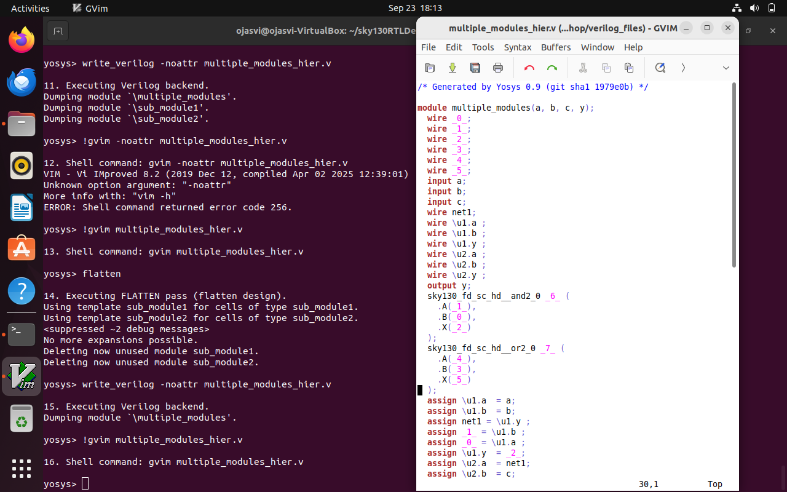
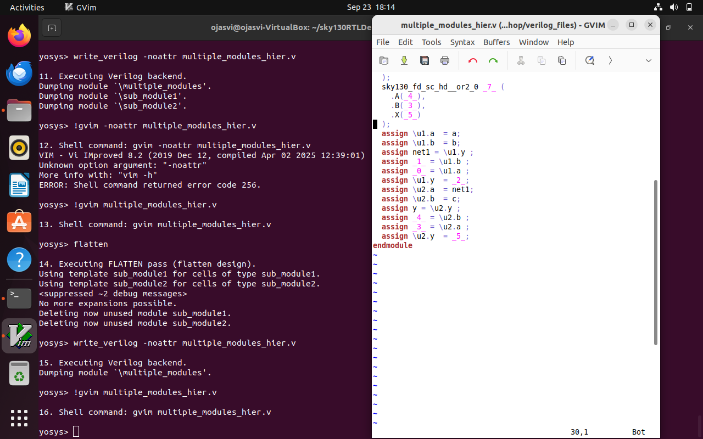
### Now lets get sub-modules separately
```bash
$yosys                                                                             
yosys> read_liberty -lib ../my_lib/lib/sky130_fd_sc_hd__tt_025C_1v80.lib           
yosys> read_verilog good_mux.v                                                     
yosys> synth -top sub_module1
yosys> abc -liberty ../my_lib/lib/sky130_fd_sc_hd__tt_025C_1v80.lib
yosys> show
```
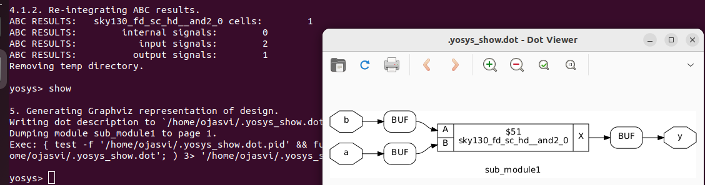


## Various flop coding styles 

Flipflops stores single bit data and they are used to avoid glitches in sequential circuit design whereas in combinational circuit design there are no such memory storing devices causing glitches.(Example D-flipflops,SR-flipflops)
Let's start,
```bash
$ iverilog dff_asyncres.v tb_dff_asyncres.v
$ ./a.out
$ gtkwave tb_dff_asyncres.vcd
```
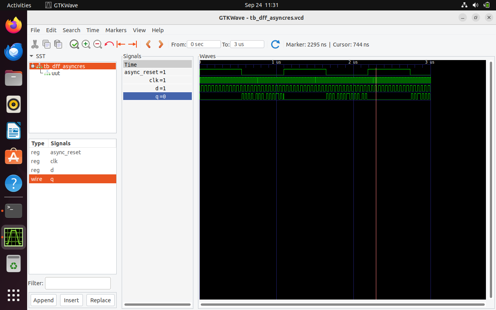

```bash
$yosys
yosys> read_liberty -lib ../my_lib/lib/sky130_fd_sc_hd__tt_025C_1v80.lib           
yosys> read_verilog dff_asyncres.v                                                     
yosys> synth -top dff_asyncres                                                         
yosys> dfflibmap -liberty ../my_lib/lib/sky130_fd_sc_hd__tt_025C_1v80.lib
yosys> abc -liberty ../my_lib/lib/sky130_fd_sc_hd__tt_025C_1v80.lib                    
yosys> show 
```
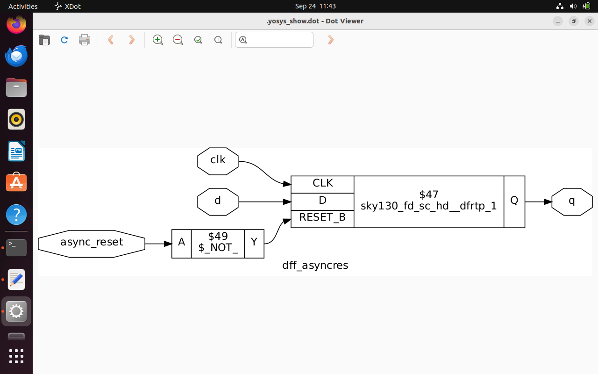

### Similarly more examples
```bash
$ iverilog dff_async_set.v tb_dff_async_set.v
$ ./a.out
$ gtkwave tb_dff_async_set.vcd
$yosys
yosys> read_liberty -lib ../my_lib/lib/sky130_fd_sc_hd__tt_025C_1v80.lib           
yosys> read_verilog dff_async_set.v                                                     
yosys> synth -top dff_asyncres_set                                                         
yosys> dfflibmap -liberty ../my_lib/lib/sky130_fd_sc_hd__tt_025C_1v80.lib
yosys> abc -liberty ../my_lib/lib/sky130_fd_sc_hd__tt_025C_1v80.lib                    
yosys> show 
```
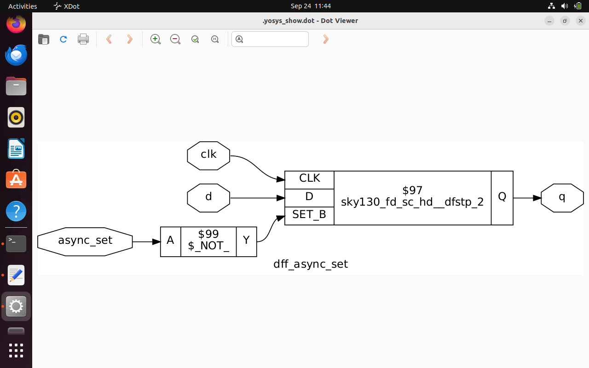

```bash
$ iverilog dff_asyncres_syncres.v tb_dff_asyncres_syncres.v
$ ./a.out
$ gtkwave tb_dff_asyncres_syncres.vcd
$yosys
yosys> read_liberty -lib ../my_lib/lib/sky130_fd_sc_hd__tt_025C_1v80.lib           
yosys> read_verilog dff_asyncres_syncres.v                                                    yosys> synth -top dff_asyncres_syncres                                                        
yosys> dfflibmap -liberty ../my_lib/lib/sky130_fd_sc_hd__tt_025C_1v80.lib
yosys> abc -liberty ../my_lib/lib/sky130_fd_sc_hd__tt_025C_1v80.lib                    
yosys> show 
```
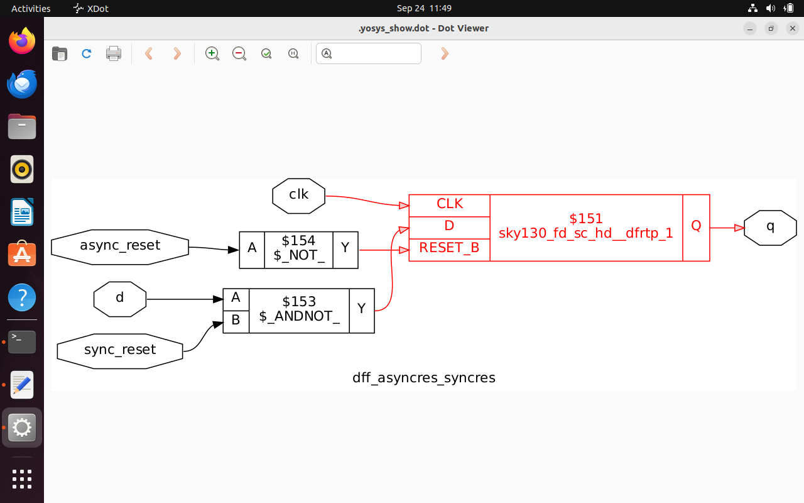

### Some examples related to mult files

```bash
$ gvim mult8.v
```
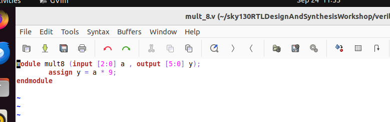

```bash
$ gvim mult2.v
```
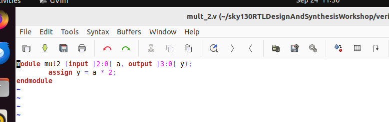

```bash
$yosys
yosys> read_liberty -lib ../my_lib/lib/sky130_fd_sc_hd__tt_025C_1v80.lib           
yosys> read_verilog mult_2.v
yosys> synth -top mul2                                                        
yosys> abc -liberty ../my_lib/lib/sky130_fd_sc_hd__tt_025C_1v80.lib                    
yosys> show
yosys> write_verilog -noattr mult_2.v                   
yosys> !gvim mul2_net.v
```
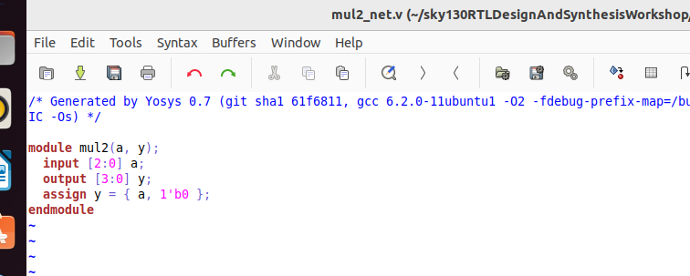
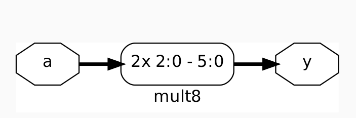
