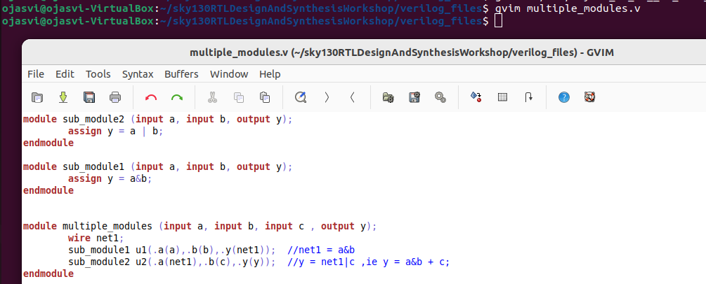

# Week1 Day2:Hierarchical vs Flat Synthesis and Various flop coding styles 

Day2 consist of some working on multiple_modules.v and its subsequent sub-modules.

Now first lets go on meaning of one of the library sky130_fd_sc_hd_tt_025C_1v80.lib.Whereas fd denotes foundry ,sd denotes standard cell ,hd denotes high density, tt denotes typical process ,025C denotes temperature and 1v80 denotes voltage.(tt_025C_1v80 called as process, temperature and voltage)

## Hierarchical vs Flat Synthesis
We will begin with multiple_module.v
```bash
$ gvim multiple_modules.v
```


