# Week1 Day3:Optimization combinational logic , sequential and unused state

Day3 consist of some RTL design , simulations(iverilog) , testbench creation and synthesis (converting RTL to netlist via yosys).

## Optimization combinational logic
Squeezing the logic to get the most optimised design (area and power saving) , constant propagation (direct optimization) , Boolean logic optimization (K-Map).
Here a command opt_clean -purge introduced.
```bash
$yosys                                                                             
yosys> read_liberty -lib ../my_lib/lib/sky130_fd_sc_hd__tt_025C_1v80.lib           
yosys> read_verilog opt_check.v                                                     
yosys> synth -top opt_check
yosys> opt_clean -purge                                                         
yosys> abc -liberty ../my_lib/lib/sky130_fd_sc_hd__tt_025C_1v80.lib                     
yosys> show
```
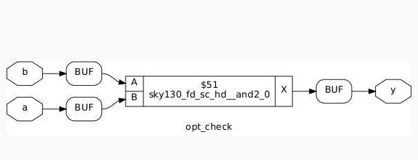

### More examples
```bash
$yosys                                                                             
yosys> read_liberty -lib ../my_lib/lib/sky130_fd_sc_hd__tt_025C_1v80.lib           
yosys> read_verilog opt_check2.v                                                     
yosys> synth -top opt_check
yosys> opt_clean -purge                                                         
yosys> abc -liberty ../my_lib/lib/sky130_fd_sc_hd__tt_025C_1v80.lib                     
yosys> show
```
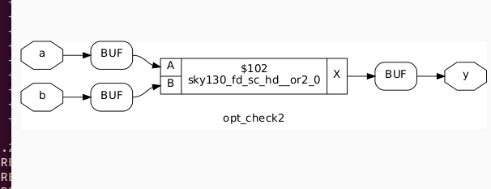

```bash
$yosys                                                                             
yosys> read_liberty -lib ../my_lib/lib/sky130_fd_sc_hd__tt_025C_1v80.lib           
yosys> read_verilog opt_check3.v                                                     
yosys> synth -top opt_check
yosys> opt_clean -purge                                                         
yosys> abc -liberty ../my_lib/lib/sky130_fd_sc_hd__tt_025C_1v80.lib                     
yosys> show
```
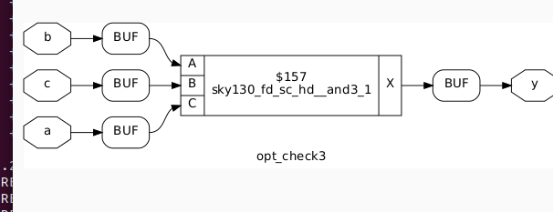

### Now an example of multiple_module_opt

```bash
$yosys                                                                             
yosys> read_liberty -lib ../my_lib/lib/sky130_fd_sc_hd__tt_025C_1v80.lib           
yosys> read_verilog multiple_module_opt.v                                                     
yosys> synth -top multiple_module_opt
yosys> flatten
yosys> opt_clean -purge                                                         
yosys> abc -liberty ../my_lib/lib/sky130_fd_sc_hd__tt_025C_1v80.lib                     
yosys> show
```
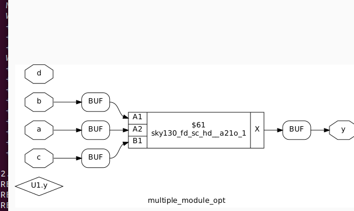


## Optimization sequential logic
In this we studied two types Basic and Advanced, in basic we did sequential constant propagation and in advanced we have cloning(physical analysis) , state optimization(optimization of unused state) , retiming.
```bash
$ iverilog dff_const1.v tb_dff_const1.v
$ ./a.out
$ gtkwave tb_dff_const1.vcd
```
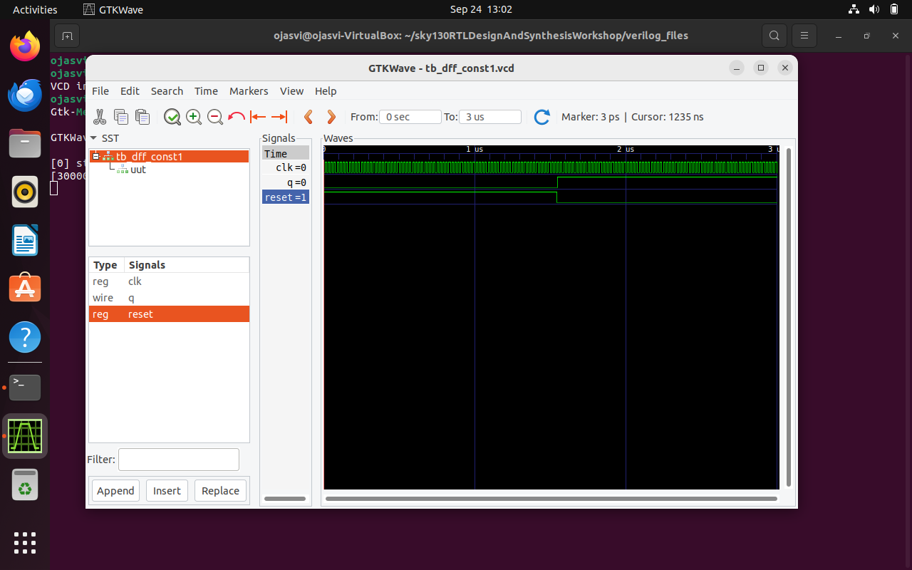

```bash
$yosys
yosys> read_liberty -lib ../my_lib/lib/sky130_fd_sc_hd__tt_025C_1v80.lib           
yosys> read_verilog dff_const1.v                                                     
yosys> synth -top dff_const1                                                         
yosys> dfflibmap -liberty ../my_lib/lib/sky130_fd_sc_hd__tt_025C_1v80.lib
yosys> abc -liberty ../my_lib/lib/sky130_fd_sc_hd__tt_025C_1v80.lib                    
yosys> show 
```
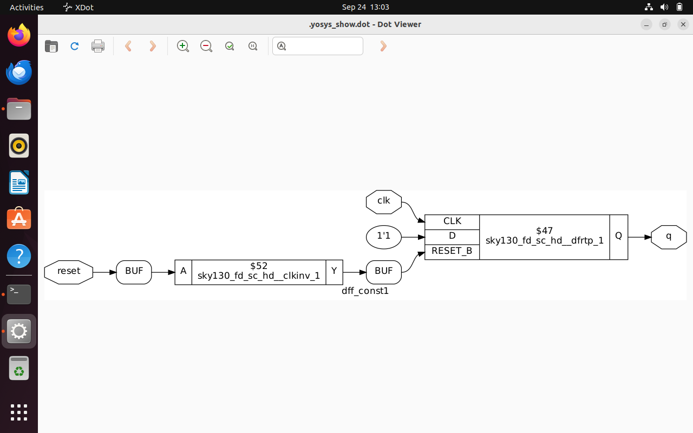

```bash
$yosys
yosys> read_liberty -lib ../my_lib/lib/sky130_fd_sc_hd__tt_025C_1v80.lib           
yosys> read_verilog dff_const2.v                                                     
yosys> synth -top dff_const2                                                       
yosys> dfflibmap -liberty ../my_lib/lib/sky130_fd_sc_hd__tt_025C_1v80.lib
yosys> abc -liberty ../my_lib/lib/sky130_fd_sc_hd__tt_025C_1v80.lib                    
yosys> show 
```
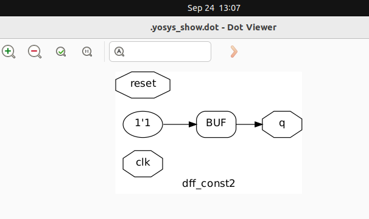

```bash
$yosys
yosys> read_liberty -lib ../my_lib/lib/sky130_fd_sc_hd__tt_025C_1v80.lib           
yosys> read_verilog dff_const3.v                                                     
yosys> synth -top dff_const3                                                         
yosys> dfflibmap -liberty ../my_lib/lib/sky130_fd_sc_hd__tt_025C_1v80.lib
yosys> abc -liberty ../my_lib/lib/sky130_fd_sc_hd__tt_025C_1v80.lib                    
yosys> show 
```
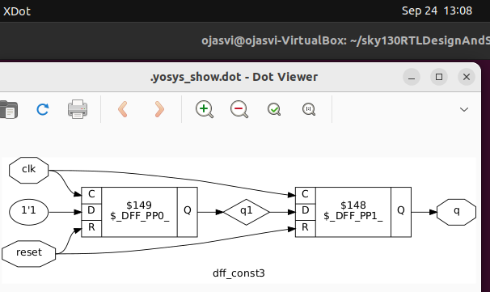

## Optimization of unused state

```bash
$yosys
yosys> read_liberty -lib ../my_lib/lib/sky130_fd_sc_hd__tt_025C_1v80.lib           
yosys> read_verilog counter_opt.v                                                     
yosys> synth -top counter_opt                                                        
yosys> dfflibmap -liberty ../my_lib/lib/sky130_fd_sc_hd__tt_025C_1v80.lib
yosys> opt_clean -purge
yosys> abc -liberty ../my_lib/lib/sky130_fd_sc_hd__tt_025C_1v80.lib                    
yosys> show 
```
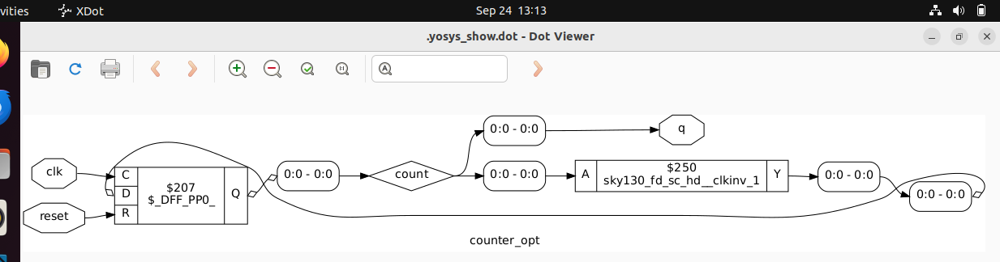

```bash
$yosys
yosys> read_liberty -lib ../my_lib/lib/sky130_fd_sc_hd__tt_025C_1v80.lib           
yosys> read_verilog counter_opt.v                                                     
yosys> synth -top counter_opt                                                        
yosys> dfflibmap -liberty ../my_lib/lib/sky130_fd_sc_hd__tt_025C_1v80.lib
yosys> abc -liberty ../my_lib/lib/sky130_fd_sc_hd__tt_025C_1v80.lib                    
yosys> show 
```
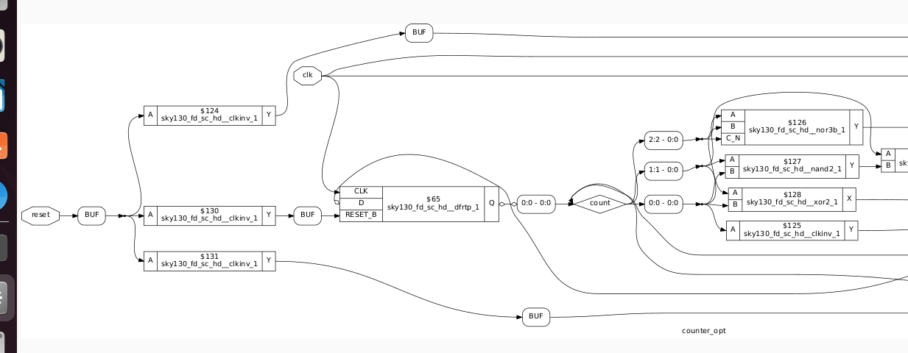
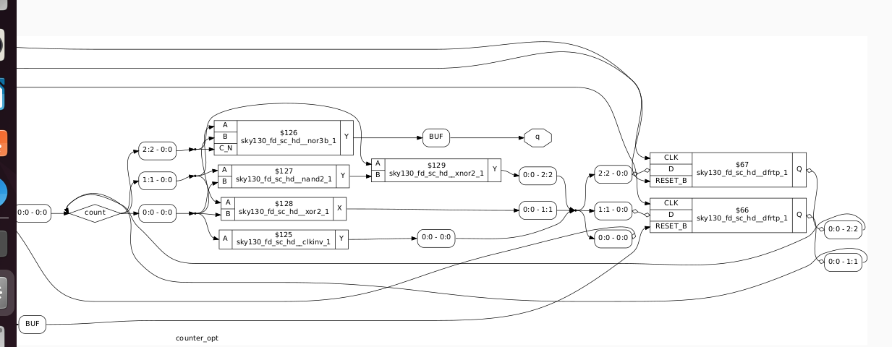
