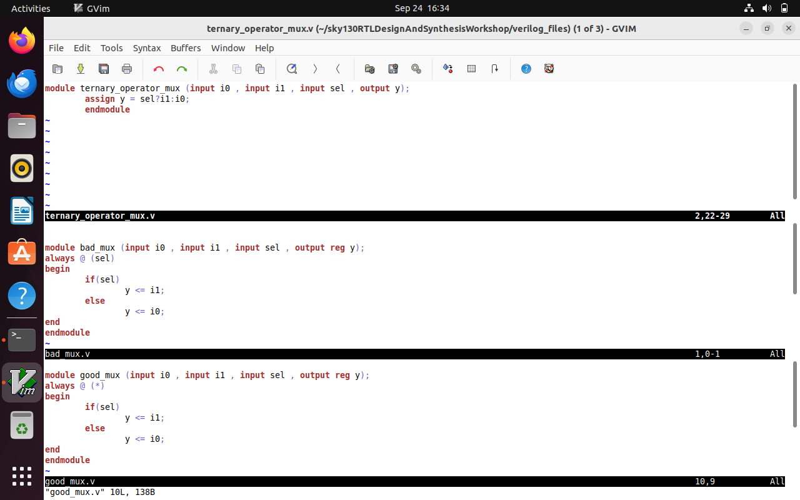
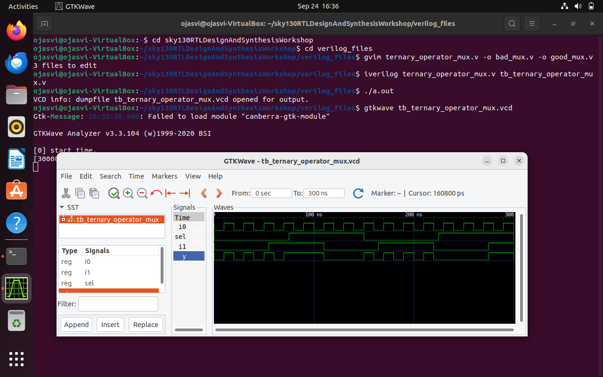

# Week1 Day4:GLS (RTL-->run-->we validate it by testing as per specifications)

### What is GLS ?
Here we run test bench with netlist as design under test. Netlist is logically same as RTL code therefore input and output nodes are same .

### Why GLS ?
Verify logic correctness of design after synthesis , insuring the timing of the design is met.
Senstivity: Change in input causes change in output. Remember to use non blocking whenever using sequential circuit.

### Ternary operator , bad and good mux examples

```bash
$ gvim ternary_operator_mux.v -o bad_mux.v -o good_mux.v
```


```bash
$ iverilog ternary_operator_mux.v tb_ternary_operator_mux.v.v
$ ./a.out
$ gtkwave tb_ternary_operator_mux.vcd
```


```bash
$yosys
yosys> read_liberty -lib ../my_lib/lib/sky130_fd_sc_hd__tt_025C_1v80.lib           
yosys> read_verilog ternary_operator_mux.v                                                   
yosys> synth -top ternary_operator_mux                                                      
yosys> abc -liberty ../my_lib/lib/sky130_fd_sc_hd__tt_025C_1v80.lib
yosys> write_verilog -noattr                  
yosys> show 
```

