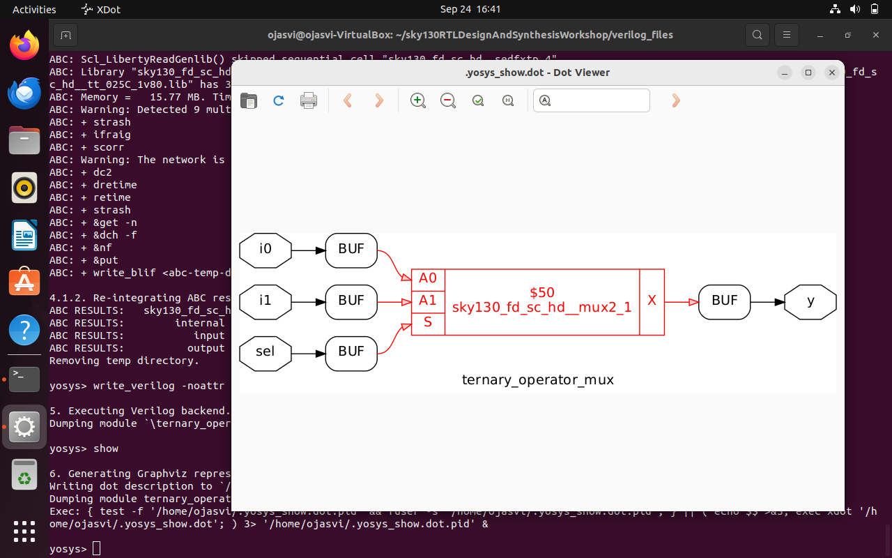
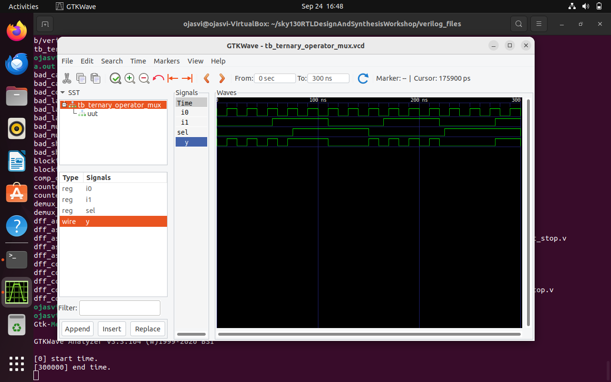
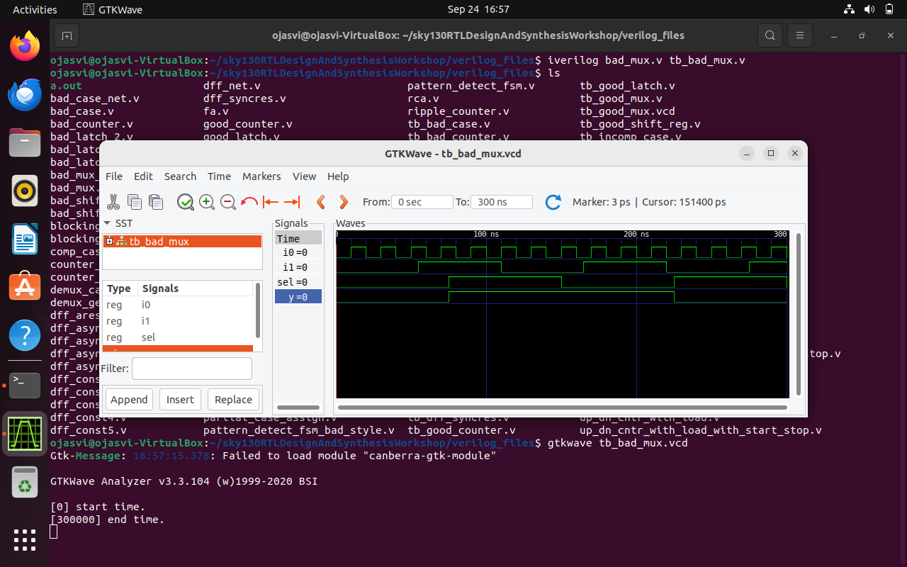
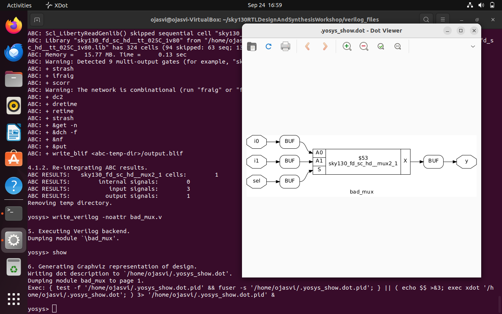
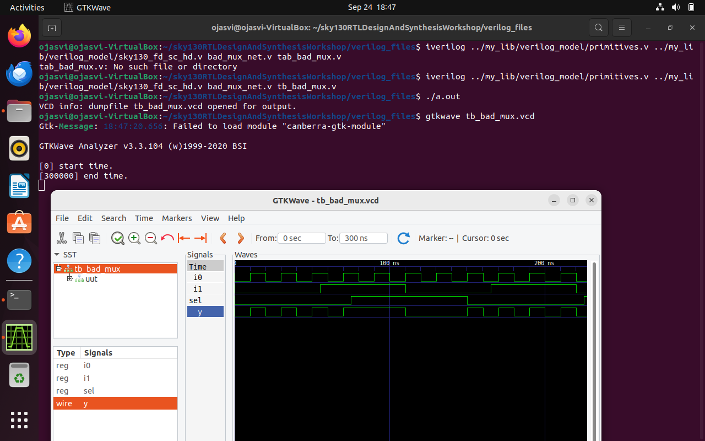
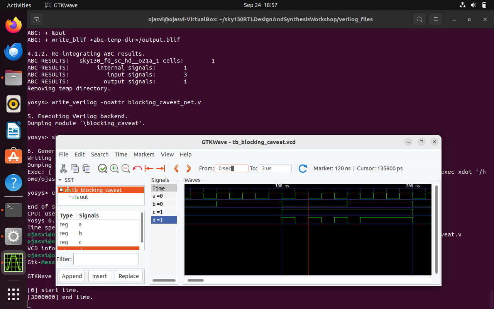
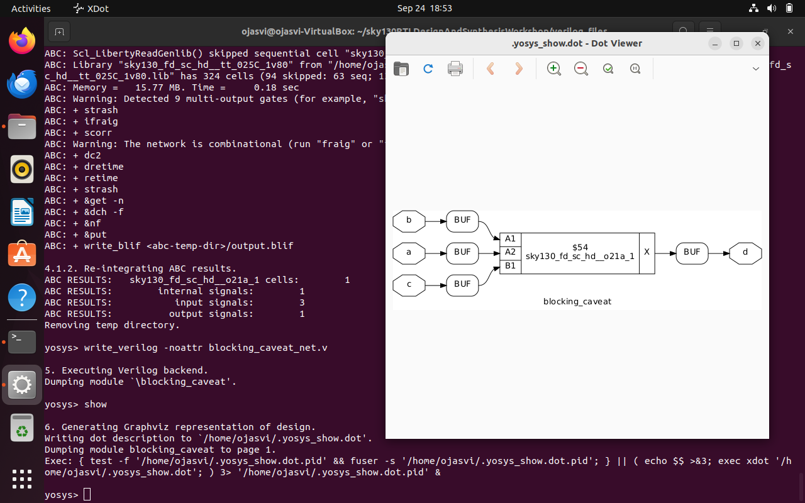
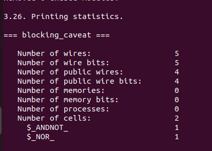
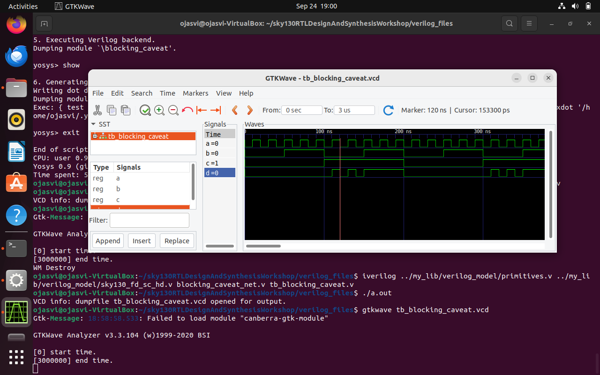

# Week1 Day4:GLS (RTL-->run-->we validate it by testing as per specifications)

### What is GLS ?
Here we run test bench with netlist as design under test. Netlist is logically same as RTL code therefore input and output nodes are same .

### Why GLS ?
Verify logic correctness of design after synthesis , insuring the timing of the design is met.
Senstivity: Change in input causes change in output. Remember to use non blocking whenever using sequential circuit.

### Ternary operator , bad mux and blocking caveat examples

### Ternary operator
```bash
$ gvim ternary_operator_mux.v -o bad_mux.v -o good_mux.v
```


```bash
$ iverilog ternary_operator_mux.v tb_ternary_operator_mux.v.v
$ ./a.out
$ gtkwave tb_ternary_operator_mux.vcd
```


```bash
$yosys
yosys> read_liberty -lib ../my_lib/lib/sky130_fd_sc_hd__tt_025C_1v80.lib           
yosys> read_verilog ternary_operator_mux.v                                                   
yosys> synth -top ternary_operator_mux                                                      
yosys> abc -liberty ../my_lib/lib/sky130_fd_sc_hd__tt_025C_1v80.lib
yosys> write_verilog ternary_operator_mux_net.v                
yosys> show 
```


```bash
$ iverilog ../my_lib/verilog_model/primitives.v  ../my_lib/verilog_model/sky130_fd_sc_hd.v ternary_operator_mux_net.v tb_ternary_operator_mux.v
$ ./a.out
$ gtkwave tb_ternary_operator_mux.vcd
```


### Bad mux

```bash
$ iverilog bad_mux.v tb_bad_mux
$ ./a.out
$ gtkwave tb_bad_mux.vcd
```


```bash
$yosys
yosys> read_liberty -lib ../my_lib/lib/sky130_fd_sc_hd__tt_025C_1v80.lib           
yosys> read_verilog bad_mux.v                                                   
yosys> synth -top bad_mux                                                     
yosys> abc -liberty ../my_lib/lib/sky130_fd_sc_hd__tt_025C_1v80.lib
yosys> write_verilog bad_mux_net.v                
yosys> show 
```


```bash
$ iverilog ../my_lib/verilog_model/primitives.v  ../my_lib/verilog_model/sky130_fd_sc_hd.v bad_mux_net.v tb_bad_mux.v
$ ./a.out
$ gtkwave tb_bad_mux.vcd
```


### Blocking caveat

```bash
$ iverilog blocking_caveat.v tb_blocking_caveat.v
$ ./a.out
$ gtkwave tb_blocking_caveat.vcd
```


```bash
$yosys
yosys> read_liberty -lib ../my_lib/lib/sky130_fd_sc_hd__tt_025C_1v80.lib           
yosys> read_verilog blocking_caveat.v                                                   
yosys> synth -top blocking_caveat                                         
yosys> abc -liberty ../my_lib/lib/sky130_fd_sc_hd__tt_025C_1v80.lib
yosys> write_verilog blocking_caveat_net.v                
yosys> show 
```




```bash
$ iverilog ../my_lib/verilog_model/primitives.v  ../my_lib/verilog_model/sky130_fd_sc_hd.v blocking_caveat_net.v tb_blocking_caveat.v
$ ./a.out
$ gtkwave tb_blocking_caveat.vcd
```

