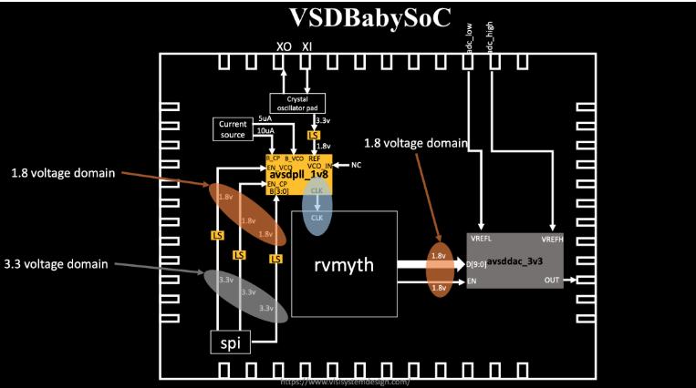

# BabySoC Fundamentals & Functional Modelling

### Objective : 
In week 2 we are going to build a solid understanding of SoC fundamentals and practise functional modelling via BabySoC using simulation tools (iverilog and GTKWave).

## Part 1 : Theory (Fundamentals of SoC Design) 
VSDBabySoC is an open source system on chip (SoC) based on RISC-V architecture for digital-analog interfacing. It combines RVMYTH processor , PLL , 10-bit DAC (all implemented using Sky130 technology).

### SoC Architecture and Components
VSDBabySoC integrates digital and analog subsystems on one chip to illustrate the principles of contemporary embedded system design. The RVMYTH core serves as the processor, which processes instructions loaded into its instruction memory (imem). During reset, the PLL is turned on to produce a stable clock signal that synchronizes the whole system. This clock runs the RVMYTH processor, which computes data and cycles values in register r17. These digital values are then routed to the DAC for analog conversion into an output signal called OUT, which can be connected to external devices such as televisions or mobile phones for audio or video output.

The integration of these elements is based on a methodical RTL-to-GDSII flow utilizing open-source tools such as OpenLANE, Yosys, and Magic. Modeling, synthesis, place-and-route, STA, and physical verification are part of the design process. Under simulation, the PLL creates the CLK signal, thereby facilitating sequential execution in RVMYTH, while the DAC converts 10-bit digital output (RV_TO_DAC[9:0]) into an analog waveform. For simulation constraints, analog behavior is simulated through Verilog's real data type, although synthesis on real hardware utilizes normal wire types.

