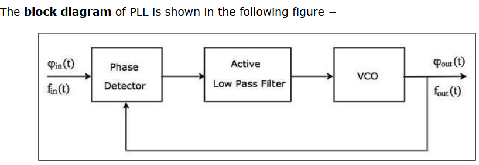
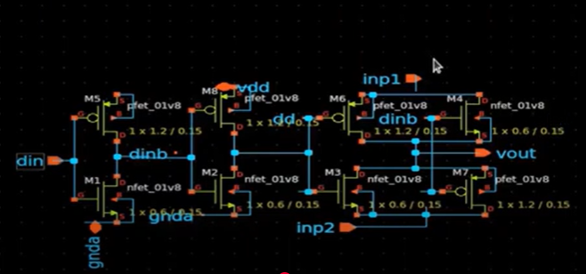
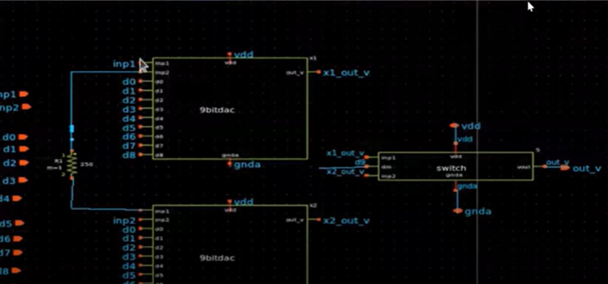

# BabySoC Fundamentals & Functional Modelling

### Objective : 
In week 2 we are going to build a solid understanding of SoC fundamentals and practise functional modelling via BabySoC using simulation tools (iverilog and GTKWave).

## Part 1 : Theory (Fundamentals of SoC Design) 
VSDBabySoC is an open source system on chip (SoC) based on RISC-V architecture for digital-analog interfacing. It combines RVMYTH processor , PLL , 10-bit DAC (all implemented using Sky130 technology).

### SoC Architecture and Components
VSDBabySoC integrates digital and analog subsystems on one chip to illustrate the principles of contemporary embedded system design. The RVMYTH core serves as the processor, which processes instructions loaded into its instruction memory (imem). During reset, the PLL is turned on to produce a stable clock signal that synchronizes the whole system. This clock runs the RVMYTH processor, which computes data and cycles values in register r17. These digital values are then routed to the DAC for analog conversion into an output signal called OUT, which can be connected to external devices such as televisions or mobile phones for audio or video output.

The integration of these elements is based on a methodical RTL-to-GDSII flow utilizing open-source tools such as OpenLANE, Yosys, and Magic. Modeling, synthesis, place-and-route, STA, and physical verification are part of the design process. Under simulation, the PLL creates the CLK signal, thereby facilitating sequential execution in RVMYTH, while the DAC converts 10-bit digital output (RV_TO_DAC[9:0]) into an analog waveform. For simulation constraints, analog behavior is simulated through Verilog's real data type, although synthesis on real hardware utilizes normal wire types.
### Phase-Locked Loop (PLL) Operation
The PLL of VSDBabySoC is a control system that produces an output signal in phase-synchronized and frequency-synchronized form with respect to a reference input. It includes a phase detector, loop filter, and voltage-controlled oscillator (VCO). The phase detector detects the phase difference between the input reference signal and the feedback signal and generates an error voltage proportional to it. This error is filtered by a low-pass loop filter to eliminate high-frequency noise and then fed to the VCO, which controls its output frequency until phase difference is minimized, and lock is achieved. In VSDBabySoC, the PLL multiplies the input frequency eight times, generating a stable high-speed clock for the RVMYTH processor and DAC.

Utilization of an on-chip PLL rather than an off-chip clock source eliminates numerous challenges. Off-chip clocks are plagued by distribution delay from long interconnects, clock jitter on synchronization, and frequency variations resulting from crystal tolerance and temperature. By providing the clock internally, the PLL facilitates accurate timing coordination throughout the SoC, less external noise sensitivity, and flexible frequency scaling. This is essential for data integrity and consistent operation in mixed-signal applications where timing mismatches can ruin performance.

### Digital-to-Analog Conversion Mechanism
VSDBabySoC's 10-bit DAC translates digital signals from the RVMYTH processor into analog voltages for interfacing with the outside world. Two popular DAC structures are the weighted resistor and R-2R ladder networks. The R-2R ladder is more desirable because it is simple, scalable, and possesses in-built accuracy with only two resistor values in a recurring pattern. Each of the digital input bits drives a switch that is connected to ground or to a reference voltage to provide a binary-weighted current or voltage sum at the output. In VSDBabySoC, the DAC is driven by a 10-bit digital input (D[9:0]) and delivers an equivalent analog output (OUT), allowing continuous waveforms like sine or square waves to be generated.

High-resolution DACs such as the 10-bit example are subject to code-dependent switching glitches and nonlinearity. These are addressed in segmented architectures, where thermometer-coded most significant bits (MSBs) are mixed with binary-weighted least significant bits (LSBs) for enhanced linearity and lower distortion. Oversampling and digital interpolation methods can also be used to ease anti-imaging filter demands and increase signal-to-noise ratio (SNR). The DAC output is buffered with operational amplifiers or RF transformers for effectively driving external loads with signal integrity.

### Design Flow and Implementation
The VSDBabySoC design is based on an end-to-end mixed-signal RTL-to-GDSII flow with open-source EDA tools. The flow starts with functional modeling and pre-synthesis simulation with Icarus Verilog (iverilog) and GTKWave waveform visualization. Once correctness is verified, the design is synthesized with Yosys, mapped to the Sky130 standard cell library, and analyzed for timing with OpenSTA. For physical implementation, place-and-route, clock tree synthesis, and power distribution are automated by OpenLANE using LEF, GDS, and LIB files for analog IP blocks such as the PLL and DAC.

As full timing models for analog IPs are not easily attainable, simplified or "fake" LIB files are created to allow synthesis and STA. The LEF and GDS files of the PLL and DAC are obtained from their layouts by using Magic, a VLSI layout tool, and added to the OpenLANE flow. Floorplaning determines macro placements and pin locations for optimal routing and congestion prevention. Post-layout simulations and STA verify timing closure with slack values as reported confirming successful design convergence. The last GDSII layout is a manufacturable design in readiness for Sky130 process fabrication.

