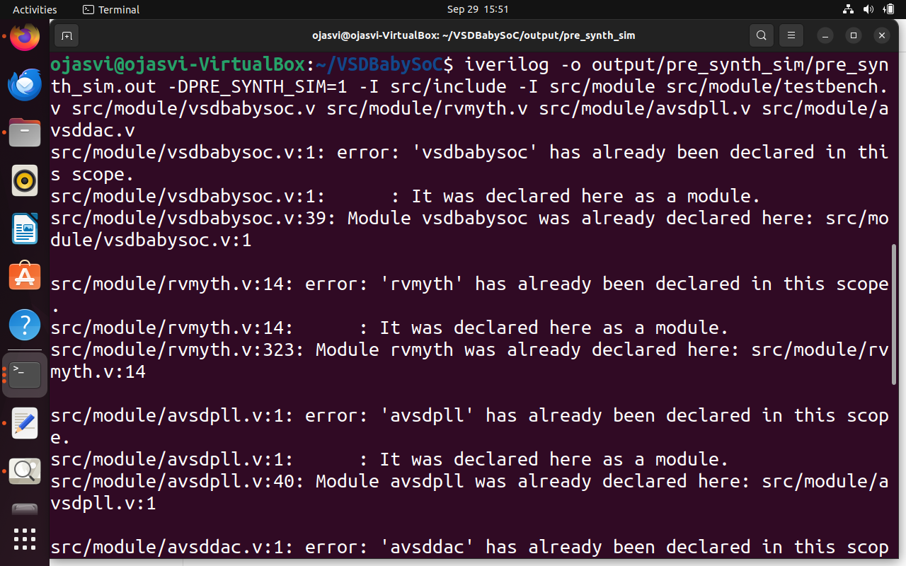
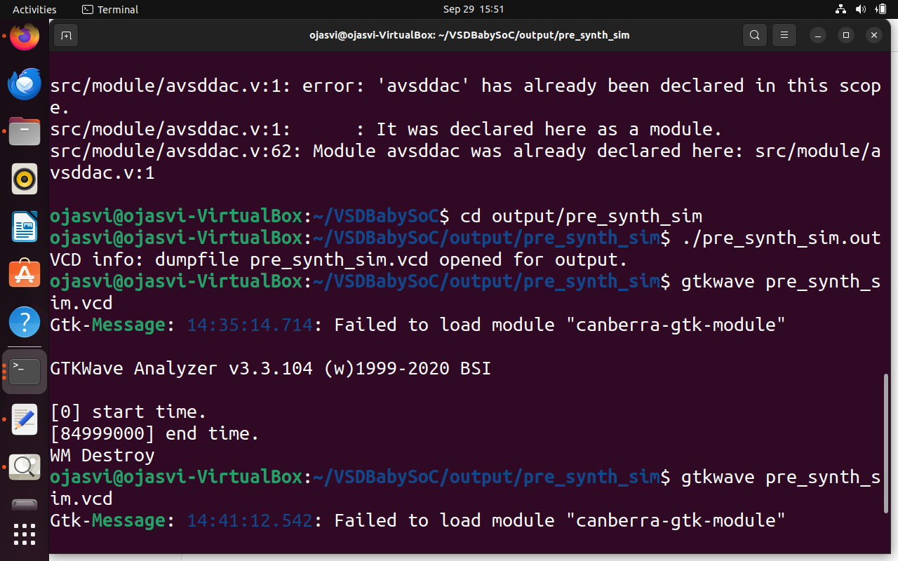

# Part 2: Labs

## Simulation Steps:
### a) Pre-Synthesis Simulation

```bash
$ iverilog -o output/pre_synth_sim/pre_synth_sim.out -DPRE_SYNTH_SIM=1 -I src/include -I src/module src/module/testbench.v src/module/vsdbabysoc.v src/module/rvmyth.v src/module/avsdpll.v src/module/avsddac.v
$ cd output/pre_synth_sim
$ gtkwave pre_synth_sim.vcd
```





### a) Post-Synthesis Simulation

```bash
$ iverilog -o output/post_synth_sim/post_synth_sim.out -DPOST_SYNTH_SIM -I src/include -I src/module src/module/testbench.v output/synthesized/vsdbabysoc.synth.v
$ cd output/post_synth_sim
$ gtkwave post_synth_sim.vcd
```
