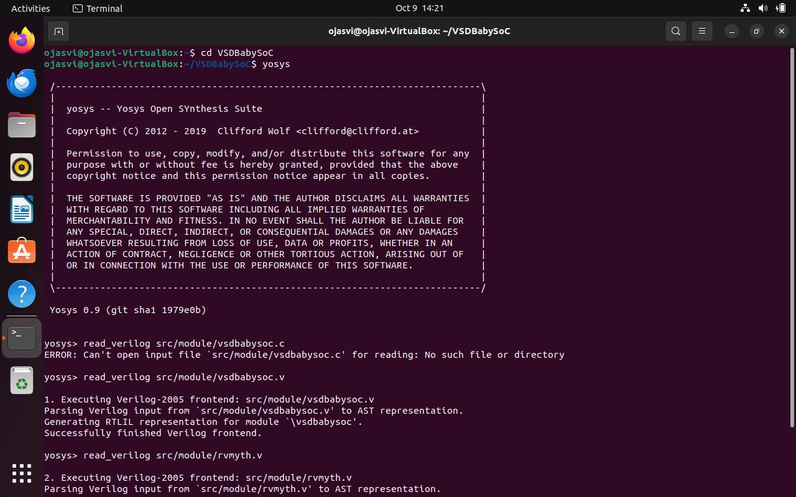
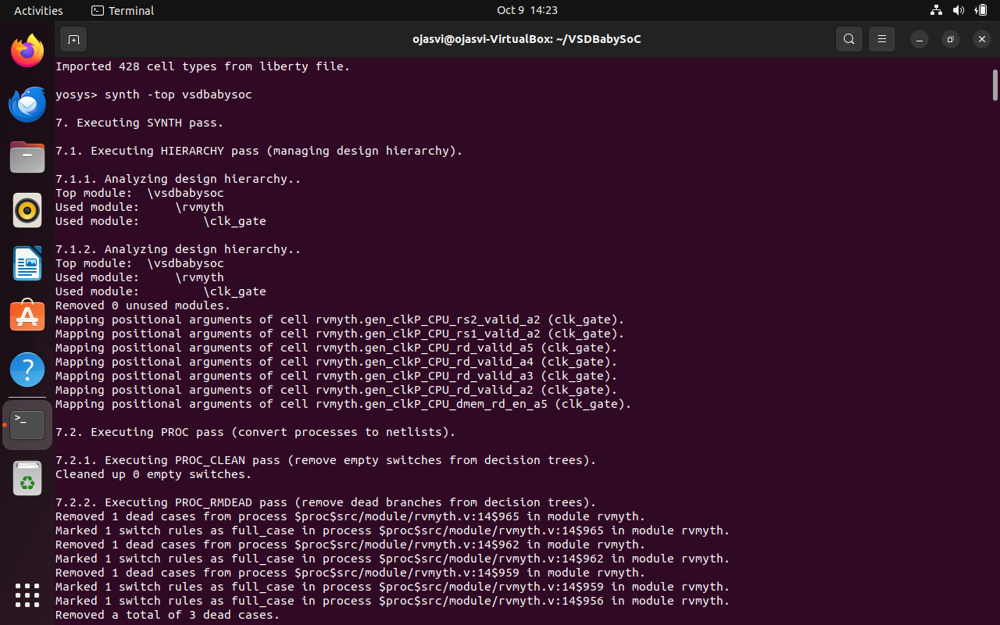
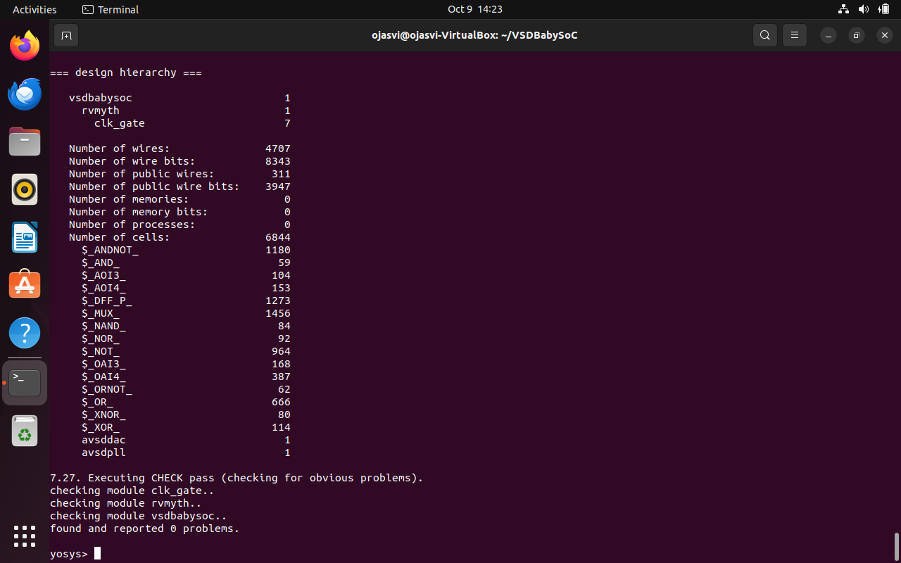
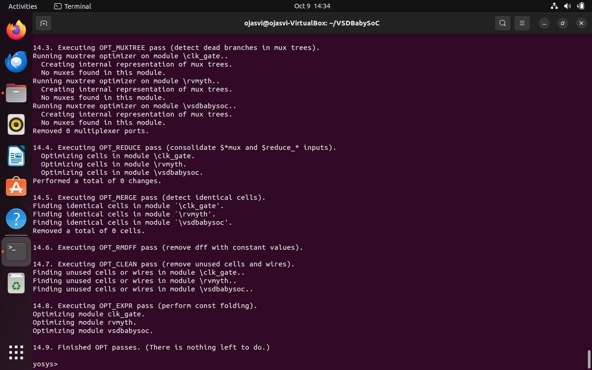
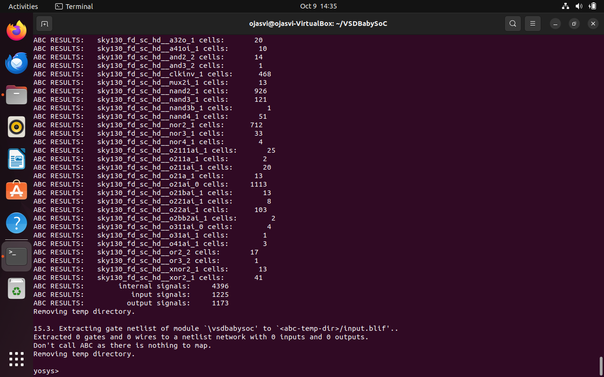
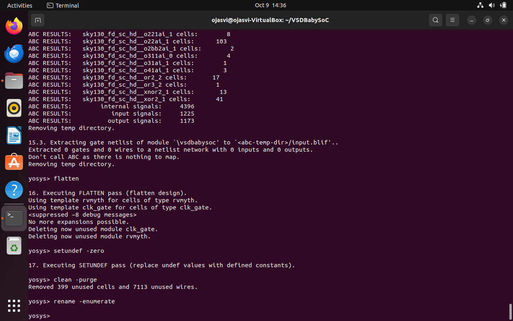
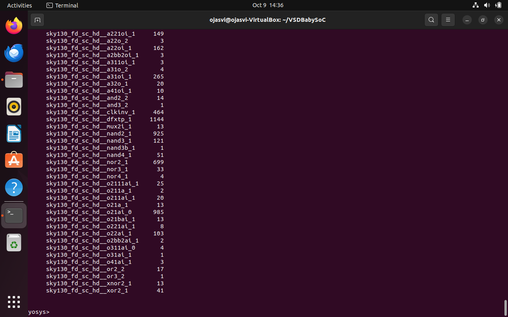
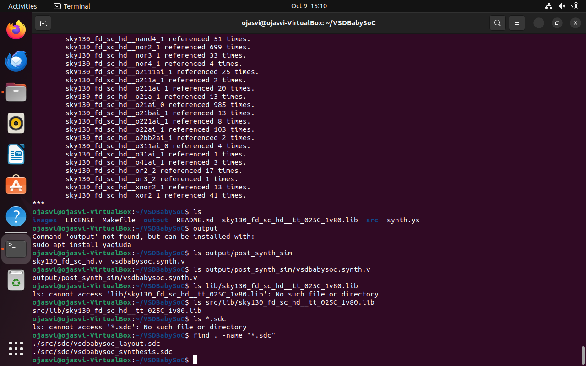

# Week3 Day1:Post-Synthesis GLS & STA Fundamentals

## Objective
This week our aim is to understand and perform Gate-level Simulation after synthesis, validate functionality and get introduced to Static timing analysis concepts with practical experiments using OpenSTA.

