# Week 4 Task – CMOS Circuit Design (sky130-style)

## Objective
This task deepens our understanding of how transistor-level circuit properties (devicephysics, sizing, variation) drive the timing behavior that STA analyzes. By working throughCMOS design and SPICE simulations (as in the sky130 workshop), you will see the “real”side of what STA approximates. This strengthens your intuition about slack, delay, noisemargins, and variation impacts.

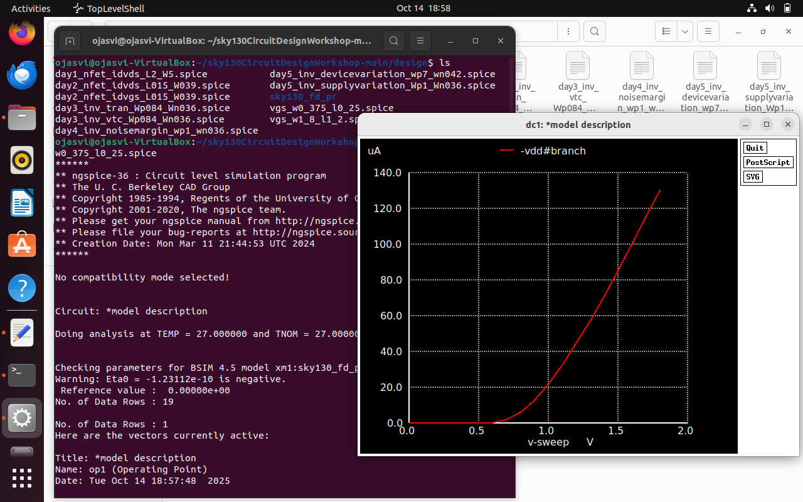
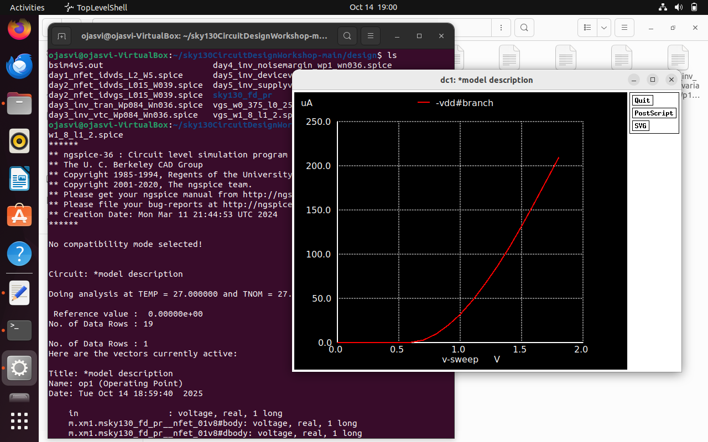
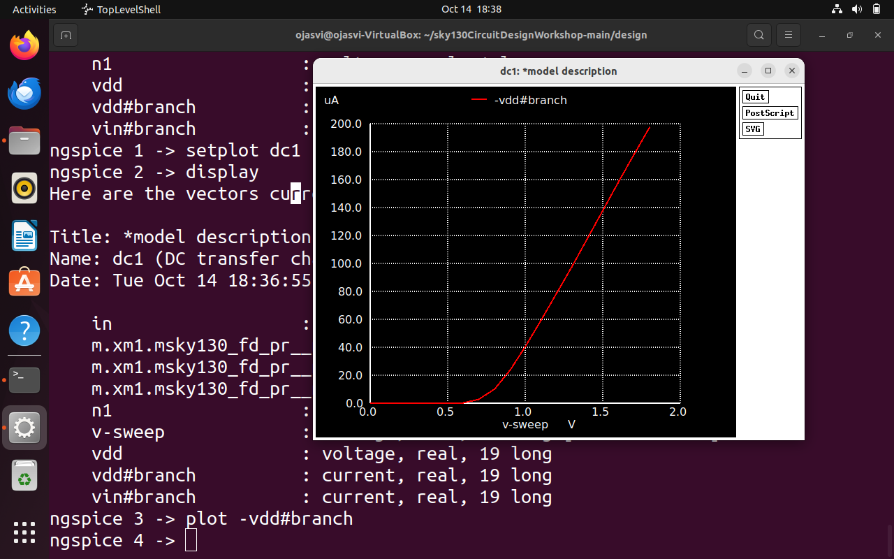
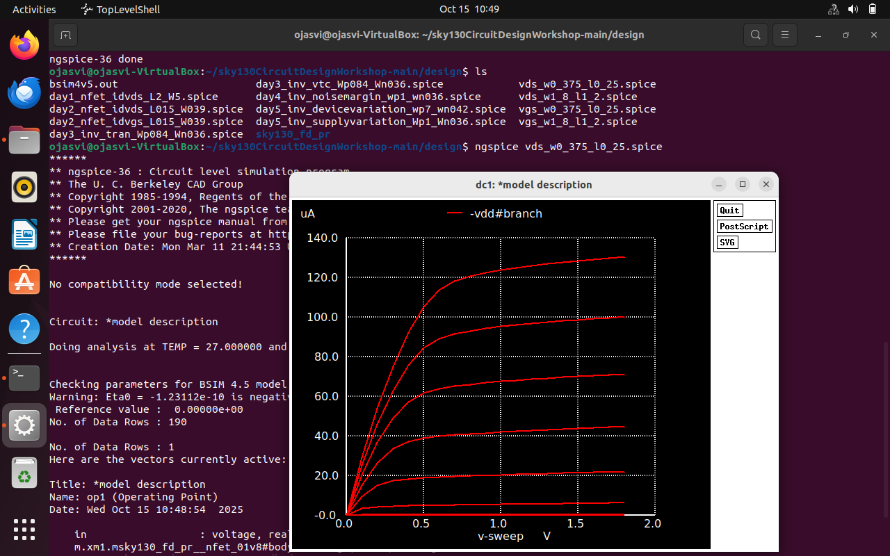
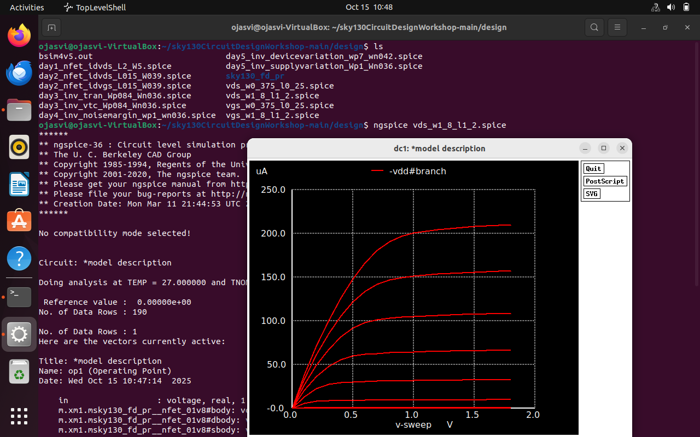
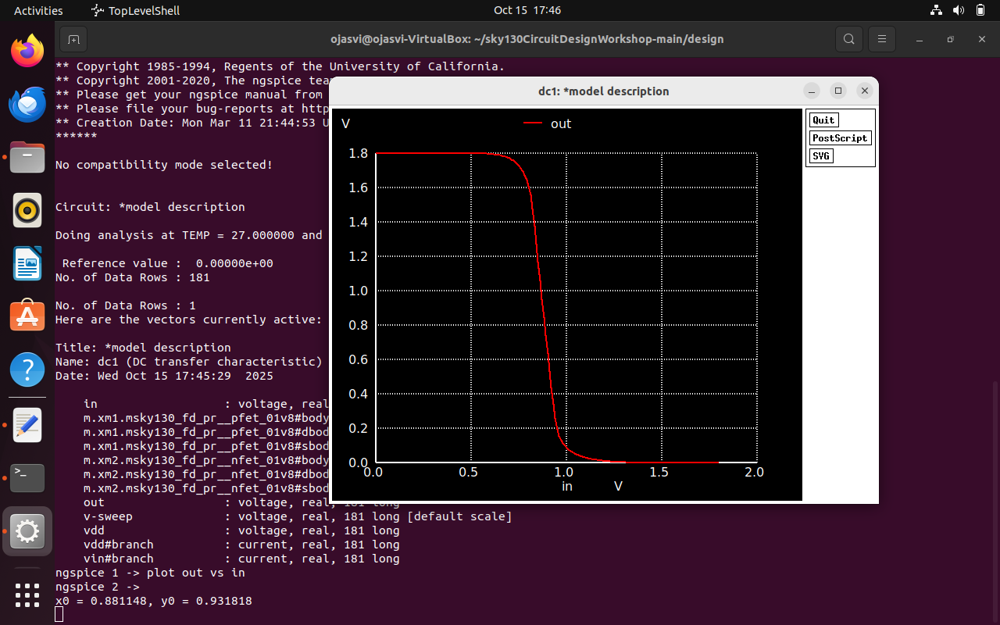
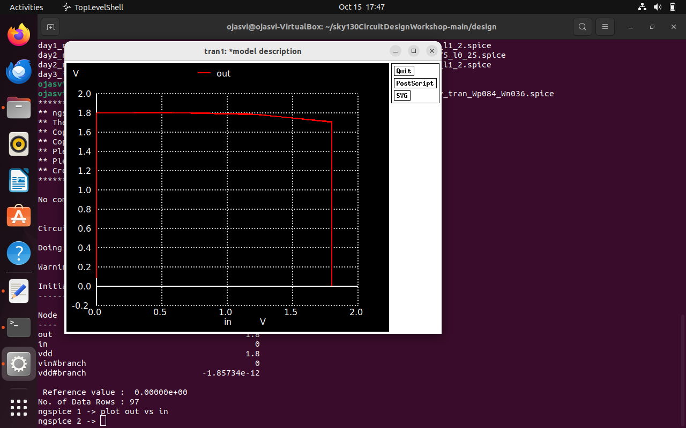
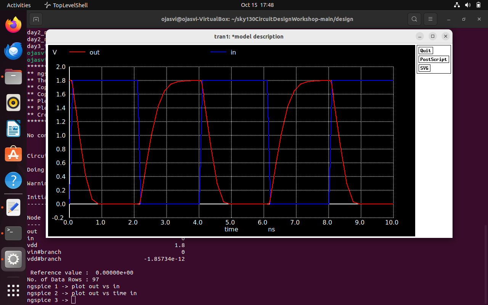
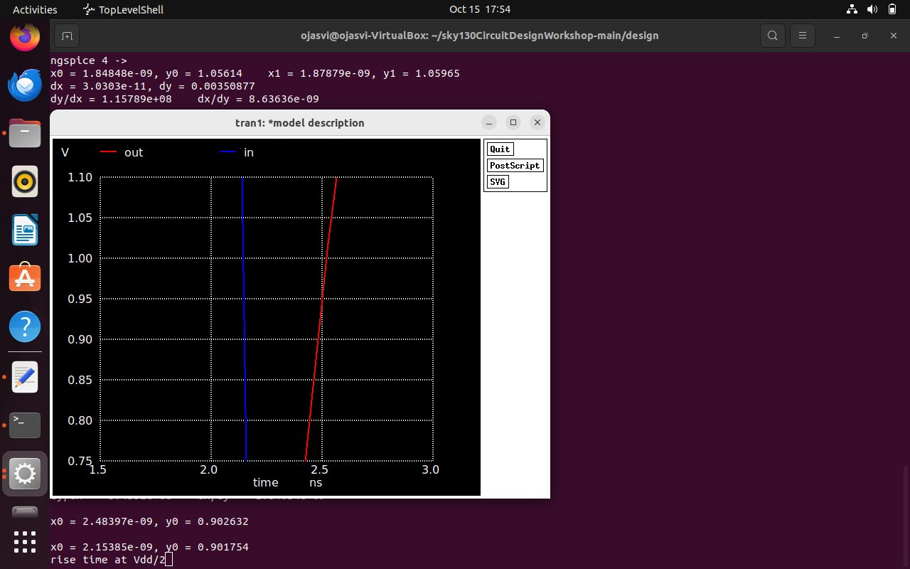
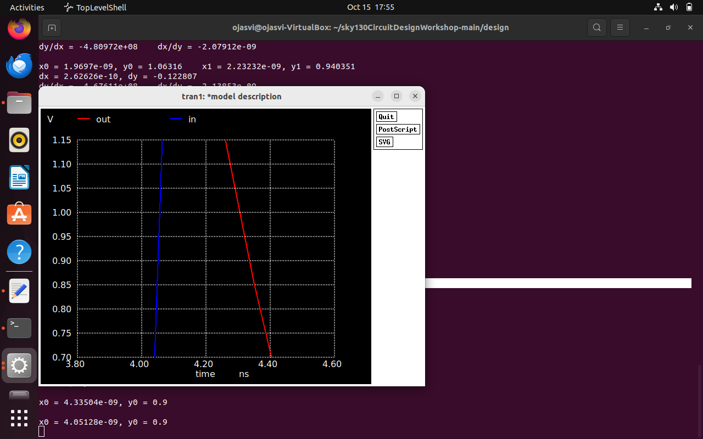
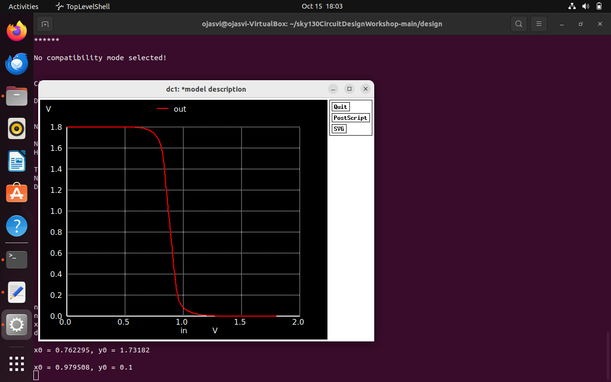
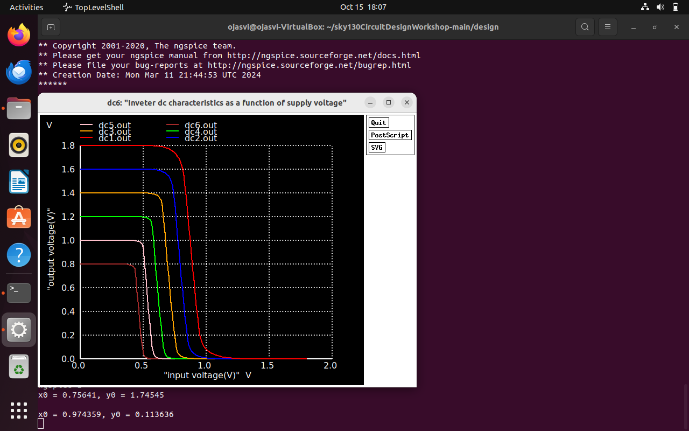

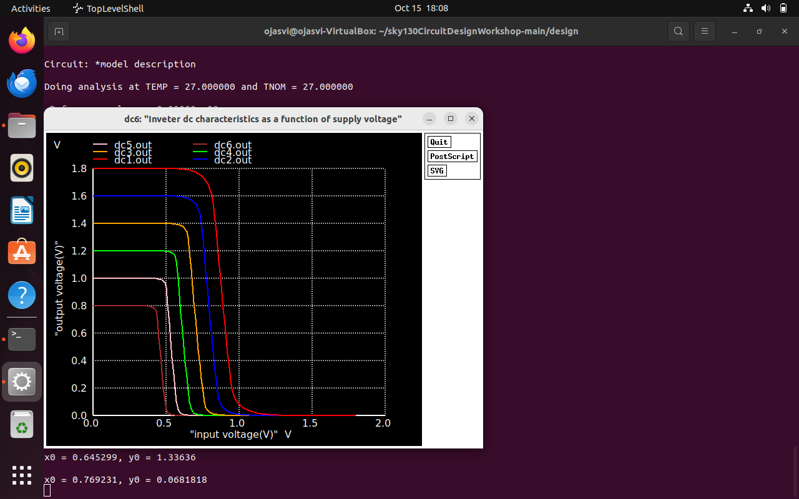
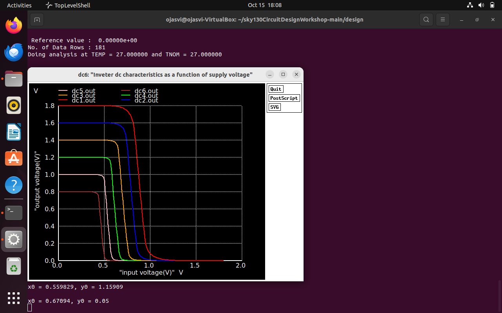

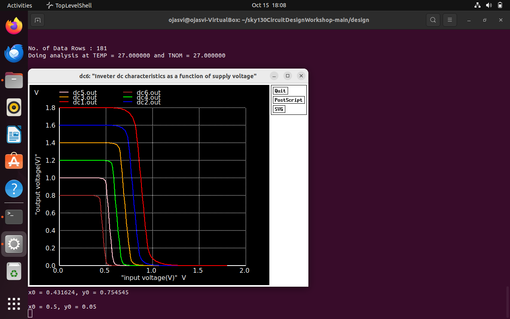
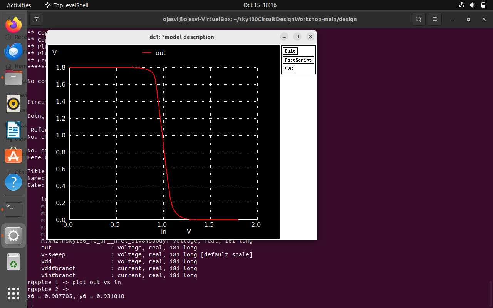
