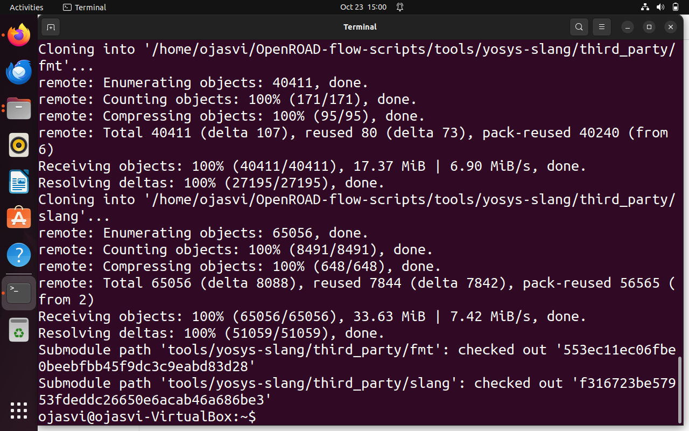
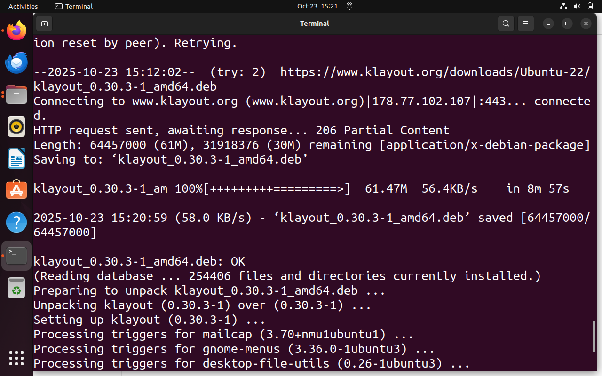
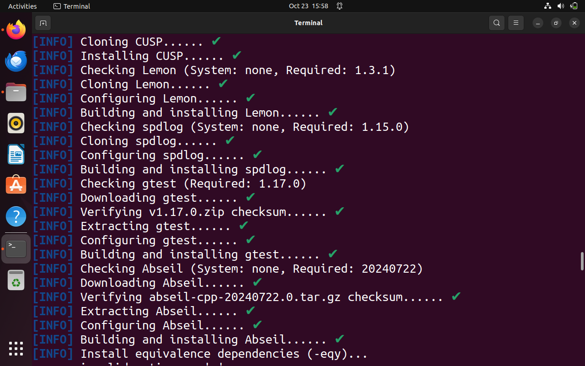

# Week5 : OpenROAD 

OpenROAD integrates several open-source tools into one streamlined flow :​
   Yosys – Performs RTL synthesis and converts Verilog into gate-level representation.
   OpenROAD App – Implements placement, clock tree synthesis, and routing.
   TritonFPlan / TritonRoute – Handles floorplanning, power delivery network, and detailed routing.
   OpenSTA – Conducts static timing analysis.
   OpenRCX – Performs parasitic extraction.
   KLayout / Magic – Used for visualization and DRC/LVS verification.
   This integration creates a smooth flow from logic design to a manufacturable chip layout, referred to as RTL-to-GDSII automation

## 
We will begin with setup
```bash
git clone --recursive https://github.com/The-OpenROAD-Project/OpenROAD-flow-scripts
cd OpenROAD-flow-scripts
sudo ./setup.sh
./build_openroad.sh --local
source ./env.sh
yosys -help
openroad -help
```





