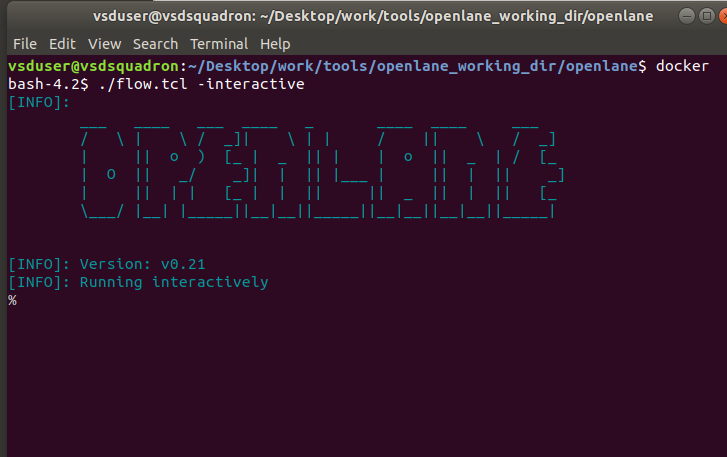
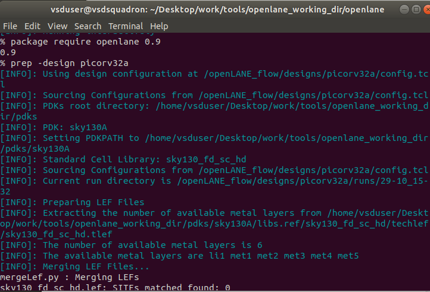
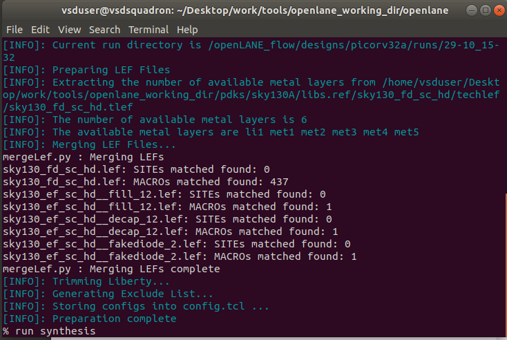
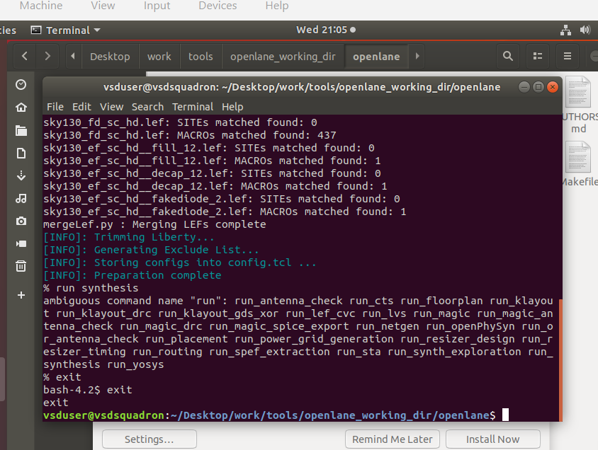
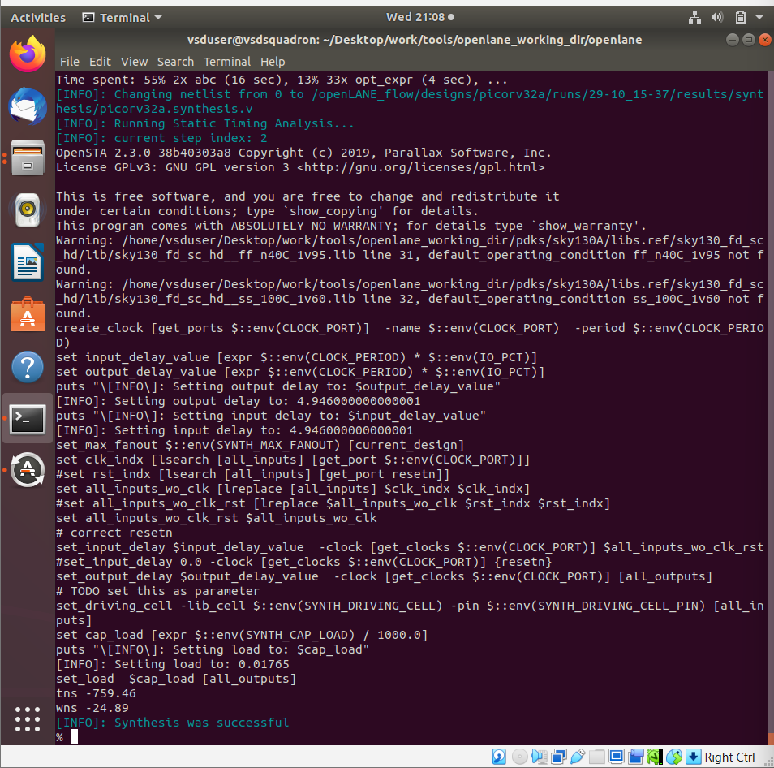
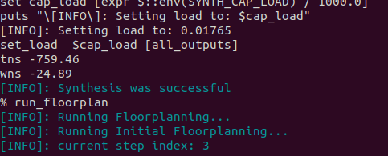

# Week 6 Task – DIGITAL-VLSI-SOC-DESIGN-AND-PLANNING
## Day1
### Introduction of open-source EDA ,OpenLANE and aky130 PDK 

How we can communicate with computer:
1. Arduino Board:
It contains an small area where chip is present that is interfaced with other pins and parts of Arduino board.The full designing of microprocessor is from RTL to GDSII flow.Arduino consist of both microcontroller and IDE which runs on computer that is then written and uploaded code to physical board.
Chip interfaces involving pads, core, and die can be understood as follows:

Pads: Pads are bonding pads on the surface of the die that serve as connection points from the chip core to the package pins. They are necessary for electrical interconnection and are accessible on the chip surface, often arranged at the periphery. Pads enable connections like power, ground, and I/O signals between the chip core and the external environment or package. Pads are not covered by passivation layers to allow wire bonding or flip-chip connections.​

Core: The core refers to the internal functional circuitry of the chip, including logic and power circuits. It consumes power supplied via the pads and bump pads and is protected by insulating/passivation layers except at the pads. The core area houses the active devices that implement the intended functionality of the IC.​

Die: The die is the physical piece of semiconductor material (usually silicon) on which the core circuitry and pads are fabricated. It includes the core, the bonding pads, power rings, and possible edge or corner regions dedicated to I/O or power pads. Die size and layout design consider pad placement for efficient power delivery and signal integrity. Die may have output interface blocks to connect to other dies or external devices
______________
In the context of a RISC-V SoC (System on Chip), components like SRAM, SoC cores, ADC, DAC, and SPI are examples of foundry IPs (Intellectual Properties). These foundry IPs are pre-designed and verified blocks provided by the semiconductor foundry or third-party vendors, which designers integrate into the chip design. 

The foundry IPs include standard cells, memory blocks like SRAM, analog/mixed-signal blocks such as ADCs and DACs, and interface modules like SPI controllers. All these IP blocks get physically realized on the silicon die through semiconductor fabrication processes such as deposition, photolithography, etching, and doping, performed by the foundry.

To summarize:
- Foundry IPs are modular building blocks (SRAM, ADC, DAC, SPI, SoC cores) incorporated into SoC designs like RISC-V.
- These IPs are fabricated using advanced semiconductor manufacturing techniques in the foundry.
- The foundry fabricates the complete chip die incorporating these IPs on silicon wafers using deposition, lithography, and other process steps.
______________
RISC-V is an open standard instruction set architecture (ISA) developed on RISC (Reduced Instruction Set Computing) principles at UC Berkeley. It is open-source and free to use, enabling broad adoption and customization without licensing fees.

RISC-V ISA features:

Fixed 32-bit base instructions naturally aligned; supports variable-length extensions (16-bit parcels).

Modular design with a base integer instruction set (RV32I or RV64I) and optional extensions for specific use cases.

Supports 32, 64, and planned 128-bit address spaces.

Instruction formats include R-type (register), I-type (immediate), S-type (store), B-type (branch), U-type (upper immediate), and J-type (jump).

Separate integer registers (32 in RV32I; 32 or 64 in RV64I) used for arithmetic, logic, memory access, and control.

Highly customizable for diverse applications—from embedded systems to supercomputers.

RISC-V's open and extensible architecture allows companies and developers to design processors optimized for performance, efficiency, power consumption, or application-specific requirements while using a standardized set of base instructions and extensions.

In SoC design, the RISC-V core can be integrated with other foundry IPs like SRAM, ADC, DAC, and SPI interfaces. The chip is fabricated by foundries using lithography and deposition techniques. The chip die contains the core logic (including the RISC-V CPU), arrays like SRAM, and interface circuits connected through pads on the die surface to the packaging and external pins via bond wires.

Thus, RISC-V provides a flexible and open foundation for SoC designs manufactured through semiconductor foundries, supporting scalable and custom processor implementations for diverse electronic systems.
_________
The flow from software applications to hardware execution involves multiple layers in a computer system:

1. Application Software:
   - This is the user-level software like apps running on the system.
   - These programs are written in high-level languages such as C, C++, or Java.

2. System Software:
   - The application software interacts with system software, which converts it into machine-understandable instructions.
   - Key parts of system software include the Operating System (OS), Compiler, and Assembler.

3. Operating System:
   - Manages hardware resources, handles input/output operations, memory allocation, and provides low-level system functions.
   - It acts as an interface between application programs and the hardware.

4. Compiler:
   - Takes program code from high-level languages and converts it into hardware-dependent instructions (assembly or intermediate machine code).
   - The instructions generated by the compiler depend on the specific hardware architecture.

5. Assembler:
   - Converts assembly language instructions into binary machine code (0s and 1s).
   - Machine code is the raw binary language a particular processor can understand and execute.

6. Hardware Chip:
   - The binary instructions are sent to the hardware chip, which performs operations based on those instructions.
   - The hardware executes functions like arithmetic, logic, memory access, and I/O as directed by the binary instructions.
   
In summary, the programming code is ultimately translated step-by-step to binary instructions that the hardware chip understands and executes, enabling software applications to run on physical hardware.
___________
To design a Digital ASIC (Application-Specific Integrated Circuit), key components and tools are required from the start:

- RTL Design (Register-Transfer Level):
  - RTL is an abstraction modeling synchronous digital circuits by describing the flow of signals between hardware registers and the logical operations on those signals.
  - It serves as the input design specification for synthesis tools.
  - Many open-source RTL designs are available from repositories like librecores.org, opencores.org, and GitHub.

- EDA Tools (Electronic Design Automation tools):
  - These tools are used for design, simulation, synthesis, verification, place and route, and physical verification of ICs and PCB systems.
  - Open-source EDA tools include Qflow, OpenROAD, and OpenLANE, which help automate the ASIC design flow from RTL to GDSII.

- PDK Data (Process Design Kit):
  - PDK is the interface between the fabrication foundry and IC design.
  - It includes process design rules (DRC, LVS, REX), standard cell libraries, input/output (I/O) libraries, and technology files.
  - PDKs model the actual semiconductor fabrication process used by the foundry.
  - Example: The open-source skywater 130nm PDK (sky130) widely used in academic and industry projects.
  - Advanced nodes like 5nm are costly and complex, so 130nm remains popular for many applications, delivering good speed and performance.

For example, the sky130_OSU PDK supports designs like the single-cycle RV32I RISC-V CPU core which can achieve clock speeds over 1 GHz.

Combining RTL designs, EDA tools, and PDK data enables a complete digital ASIC design flow, from high-level logic to the physical silicon layout ready for fabrication.
_________
The simplified RTL-to-GDSII (RTL2GDS) flow in ASIC design consists of the following key steps:

Step 1. Synthesis:
- Translate the RTL design into a gate-level netlist using standard cells from the cell library (SCL).
- The gate-level netlist is functionally equivalent to RTL and described in HDL and SPICE models.

Step 2. Floor/Power Planning:
- Plan the silicon area and partition the chip die into system blocks.
- Place I/O pads and define pin locations and rows in micro-floor planning.
- Construct the power distribution network with multiple VDD and GND lines using upper metal layers for low resistance and electromigration mitigation.

Step 3. Placement:
- Place the gate-level netlist cells aligned with floorplan sites.
- Global placement provides a rough arrangement considering timing and congestion.
- Detailed placement determines exact routes and layers to minimize area, power, vias, and meet timing constraints.

Step 4. Clock Tree Synthesis (CTS):
- Route the clock network to every sequential element (flip-flops, registers, ADCs, DACs).
- The clock network is typically a tree (H-tree, X-tree) designed to minimize skew using low-skew global routing resources.

Step 5. Routing:
- Connect pins physically using multiple metal layers defined by the PDK (e.g., sky130 with 6 metal layers).
- Routing grids formed by metal tracks are vast, so divide-and-conquer approaches are used.
- Two types: Global routing (generates routing guides) and Detailed routing (implements wiring based on guides).

Step 6. Sign Off:
- Final layout undergoes verification:
  - Design Rule Checking (DRC) validates geometric rules compliance.
  - Layout Versus Schematic (LVS) checks schematic and layout consistency.
  - Static Timing Analysis (STA) validates timing correctness.

The final output is a verified GDSII file, representing the physical layout ready for fabrication.
______
OpenLANE is an automated RTL-to-GDSII design flow that integrates multiple tools including OpenROAD, Yosys, Magic, Netgen, Fault, CVC SPEF-Extractor, CU-GR, and Klayout, along with scripts for design exploration and optimization. It was initiated as an open-source flow aimed at enabling true open-source tape-out experiments. 

StriVe is a family of "open everything" SoCs comprising open PDKs, open EDA tools, and open RTL designs, aligned with the open-source philosophy of OpenLANE.

The primary goal of OpenLANE is to produce a clean GDSII layout with no human intervention ("no-human-in-the-loop"). Clean means:
- No LVS (Layout Versus Schematic) violations
- No DRC (Design Rule Check) violations
- No timing violations

OpenLANE is specifically tuned for the skyWater 130nm open PDK technology and can also be used to harden macros and chips. It offers two modes of operation:
- Autonomous mode: a push-button flow that runs the entire process automatically.
- Interactive mode: allows running commands and steps one-by-one for granular control.

OpenLANE includes a large collection of example designs (43 with best known configurations) to facilitate learning and experimentation.

This flow significantly lowers the barrier to advanced ASIC design by providing a fully automated, open-source design flow for digital SoCs.
_________
The OpenLANE detailed ASIC design flow involves several key stages to ensure a robust chip design:

1. Design Exploration and Regression Testing:
   - OpenLANE runs on about 70 designs regularly, comparing results against known best results to validate improvements (CI).

2. Design for Test (DFT):
   - Performs scan insertion, automatic test pattern generation, test pattern compaction, fault coverage, and fault simulation to ensure testability.

3. Physical Implementation with OpenROAD:
   - The OpenROAD tool suite handles physical implementation with steps such as:
     - Floor and power planning.
     - End decoupling capacitors and tap cell insertion.
     - Global and detailed placement.
     - Post-placement optimization.
     - Clock Tree Synthesis (CTS).
     - Global and detailed routing.

4. Netlist Modification and Verification:
   - CTS and post-placement optimization modify the netlist iteratively.
   - Logic equivalence checking (using Yosys's LCE) confirms functional consistency after modifications.

5. Handling Antenna Rule Violations:
   - Antenna effects arise when metal wire segments collect charge that can damage transistor gates.
   - The router usually limits wire lengths to avoid violations.
   - If violations occur, bridging with higher metal layers or adding antenna diode cells help to leak charges.
   - OpenLANE proactively adds fake antenna diodes post-placement; real diodes replace them if violations are detected during antenna checking.

6. Static Timing Analysis (STA):
   - Extracted interconnect parasitics (via DEF to SPEF conversion) enable timing analysis using OpenSTA (OpenROAD).
   - This reports any timing violations.

7. Physical Verification:
   - Magic is used for Design Rule Checks (DRC) and layout-to-schematic comparisons (LVS).
   - Netgen is also used for LVS.
   - SPICE extraction validates layout versus electrical behavior.

This comprehensive flow from RTL to produced GDSII file ensures design correctness, manufacturability, and testability using open-source tools integrated within OpenLANE.
__________
Here is a summary highlighting the key points about getting familiar with open-source EDA tools and the OpenLANE directory structure, based on the provided information:

- Basic Linux commands used commonly in the workflow include `cd` (change directory), `ls` (list contents), `pwd` (present working directory), `mkdir` (make directory), `command --help` (help for commands), and `clear` (clear terminal screen).

- The working PDK variant is Sky130_fd_sc_hd:
  - "sky130" refers to the process or node name.
  - "fd" is the foundry name (SkyWater foundry).
  - "sc" stands for standard cell library files.
  - "hd" means high density variant.
  - Sky130_fd_sc_hd contains various technology files like Verilog, SPICE, techLEF, maglef, GDS, CDL, lib, LEF, etc. The techLEF files contain layer information.

- Design Preparation in OpenLANE:
  - The flow is initiated using `flow.tcl`, which runs the entire RTL-to-GDSII process.
  - Interactive mode allows step-by-step execution; otherwise, it runs fully automatically.
  - Designs are stored in the design folder (e.g., picorv32a).
  - Design folders contain files like `.scr`, `config.tcl` which has details like enrollment and clock period.
  - Time period can be set and overridden by configuration files with priority order.

- Running synthesis:
  - Preparation is completed with command `prep -design picorv32a`.
  - Synthesis is run with `run_synthesis`, which takes 3-4 minutes typically.
  - After synthesis, outputs such as the merged LEF file with wire and cell level info are generated.
  - The `results` folder populates with synthesis, placement, floorplan, routing, and verification reports.
  - The `config.tcl` file contains parameters used during the run and can be modified for changes such as core utilization.
  - Changes reflect during re-runs of floorplanning or synthesis.

- Characterizing synthesis results:
  - Data shows elements like number of D flip-flops and total cells.
  - Flop ratio is calculated as (number of flip flops) / (number of total cells).
  - The synthesis mapping is performed by ABC synthesis tool.
  - Reports with detailed statistics of synthesis are generated cd, ls, pwd, mkdir, command --help, clear.
____________
## Day2
Here is a structured summary of the key points regarding good floor planning considerations in VLSI chip design, enriched with the important source-language phrases:

In this section we will try to cover up the width and height of Core and Die. It is the first step in physical design flow to determine these dimensions. A netlist defines connectivity between elements such as flip-flops and gates. By converting symbolic gate representations to physical dimensions (e.g., standard cell dimension of 1 unit × 1 unit), overall area occupied by the netlist can be estimated on silicon wafer.

What is 'Core' and 'Die' section of a chip? The Die is the small semiconductor specimen on which the fundamental circuit is fabricated. The Core is inside the die, housing the fundamental logic of the design.

Utilization factor calculates the ratio of area occupied by netlist to the total core area. For example:

$$
\text{Utilization Factor} = \frac{\text{Area occupied by netlist}}{\text{Total area of the core}} = \frac{4 \times 1\ \text{sq. unit}}{2 \times 2\ \text{units}} = \frac{4}{4} = 1
$$

which means full utilization of the core area with no spare space left.

Aspect Ratio is the ratio of height to width. An Aspect Ratio of 1 typically means a square chip; otherwise, the shape is rectangular.

Additional examples show lower utilization factors (e.g., 0.25) which signify spare area available for additional cells or routing.

Define locations of Preplaced Cells by partitioning large combinational logic into blocks and extending input/output pins before black-boxing them as separate IP modules. This enables reuse of IPs (memory, clock gating cells, comparators, mux) across designs. Arrangement of these is known as floorplanning. Preplaced cells are user-defined placed cells that floorplan tools avoid relocating.

De-coupling capacitors are placed around pre-placed cells to supply peak switching currents. Due to resistive and inductive elements (Rdd, Ldd, Lss), voltage drops occur, so capacitors support the power supply locally. This reduces voltage droop that can cause logic errors.

Power planning involves designing power supply networks to maintain signal integrity on buses (e.g., 16-bit bus) by mitigating ground bounce and voltage drop issues. Multiple power and ground supply points (a mesh) reduce these problems.

Pin placement and logical cell placement blockage involve strategically placing input/output and clock pins to minimize resistance, especially since clock pins are typically larger for steady clock delivery. Pin areas are blocked during routing and cell placement to preserve connectivity and timing.

Overall, good floorplanning in VLSI involves balancing utilization, aspect ratio, preplaced cell positioning, power integrity with decoupling capacitors, and meticulous pin placement, setting the stage for subsequent physical design stages like placement, routing, and clock tree synthesis utilization factor, aspect ratio, Core, Die, floorplanning, De-coupling capacitors, mesh.
__________
The process to run floorplanning using OpenLANE involves several configuration and execution steps:

- Before running the floorplan, switches and settings related to floorplanning are set in configuration files. Common configurable parameters include:
  - Core utilization ratio (default 50%) and aspect ratio (default 1).
  - Power distribution network (PDN) files for power planning.
  - Pin placement modes (e.g., random but equal distance).
  - Configuration priority order: system default, config.tcl, and finally PDK variant config.

- The floorplan execution generates key layout files like the DEF (Design Exchange Format) file which describes die area dimensions and placement.

- To view the floorplan results, one opens the DEF file and corresponding LEF (layer extraction format) files using the Magic layout tool:
  - Command example:
  ```bash
  magic -T /path/to/sky130A.tech lef read ../../tmp/merged.lef def read picorv32a.floorplan.def
  ```
  - Magic lets you visually inspect input/output pin locations, metal layers used (e.g., metal 2, metal 3), decoupling capacitors (decap cells), and standard cells like buffers and logic gates.

- After floorplanning, placement binds the netlist logic gates (standard cells) to physical shapes and sizes, arranging them optimally on the floorplan.
  - Placement uses global placement first for rough positioning and then detailed placement for legality and timing.
  - Preplaced cells are locked to their locations, and no other cells overlap them.
  - Placement tries to minimize wire lengths and signal delay by placing connected elements close together.
  - Repeaters/buffers may be inserted if signals travel long distances to maintain signal integrity.

- Final placement optimization and timing analysis help verify the correctness and performance of the design in preparation for routing.

- Libraries contain standard cells with different sizes and timing characteristics used in the design, characterized via simulation and extracted layout data.

This process ensures a physically efficient and electrically sound layout for subsequent ASIC design stages like clock tree synthesis and routing.
_______
## Day3
## Library Cell Design with Magic Layout and ngspice

This guide covers the typical workflow for designing and characterizing a library standard cell (such as a CMOS inverter) using Magic layout and ngspice simulation.

## 1. **Floorplanning and IO Placement Revision**
- After initial floorplanning and placement, IO pin positions can be revised by changing parameters (e.g., `env(FP_IO_MODE)` in config files).
- Use Magic to open and visually inspect the layout; pin locations can be checked and adjusted.

## 2. **SPICE Netlist Creation for CMOS Inverter**
- **Define connectivity:** PMOS and NMOS drain, gate, source, substrate pins must connect to the correct signal nodes.
- **Component values:** Set device sizes; example—equal or different widths for PMOS and NMOS based on desired switching threshold (Vm).
- **Node assignment:** List all connection points for devices and external signals.
- **Add load capacitance:** Typically between output and ground for dynamic analysis.
- **Voltage sources:** Supply (`Vdd`) and input (`Vin`) set voltage ranges or pulse profiles.
- **Simulation commands:** For DC sweep (VTC), sweep `Vin` and observe `Vout`; for transient analysis, apply a pulse to `Vin`.
- **Model files:** Ensure correct process models for PMOS and NMOS are included for accurate device physics.

## 3. **Magic Layout Process**
- **Open layout (.mag) files:** Use Magic to design the physical geometry of the inverter.
- Use the tech file (.tech) matching your process (e.g., sky130A.tech).
- Paint layers for diffusion, polysilicon, contacts, and metals according to standard cell design rules.
- Visualize cell boundaries and layers to verify connectivity and isolation.

## 4. **CMOS Fabrication Steps Overview**
- **Active region creation:** Define areas for PMOS/NMOS, isolate with SiO₂ and Si₃N₄.
- **N-well/P-well doping:** Use masks and ion implantation for region formation.
- **Gate terminal formation:** Set appropriate doping, oxide thickness, and deposit polysilicon.
- **LDD (Lightly Doped Drain) formation:** Use spacers and selective doping to mitigate short-channel effects.
- **Source/drain formation:** Further ion implantation and high-temperature annealing for heavily doped terminals.
- **Local interconnects:** Deposit titanium, form silicide contacts, and etch to create reliable wiring.
- **Higher-level metalization:** Apply thick oxide layer (planarization), use CMP (polishing), then deposit and pattern metal for robust interconnects.

## 5. **ngspice Simulation and Characterization**
- **DC Sim (VTC):** Sweep `Vin` from 0 to `Vdd` and observe the inverter transfer curve (VTC), check switching threshold V_m  where  V_{in} = V_{out} .
- **Transient Sim:** Apply a pulse to `Vin`, measure output rise/fall times, extract delays and slew rates.
- **Impact of sizing:** Wider PMOS shifts  V_m  toward mid-point; choose sizes to optimize noise margins and robustness.

## 6. **Analysis and Optimization**
- **Switching threshold (Vm):** Critical for noise immunity; aim to keep it well within logic limits.
- **Static vs. dynamic response:** Static defines logical behavior; dynamic reveals performance (speed).
- **Cell library characterization:** Extract timing, power, noise data to enable accurate use in digital flows.

***

## Why Model Both Static and Dynamic Behavior for a CMOS Inverter?

**Static behavior** describes how the output voltage of a CMOS inverter relates to input voltage when signals are constant. This is crucial for understanding core logic functions like inversion, voltage transfer characteristic (VTC), noise margins, and the switching threshold $$ V_m $$—the input voltage where the inverter changes output state. Reliable static behavior ensures robust logical operation and noise immunity, which is vital for digital systems.
**Dynamic behavior** describes how the inverter reacts to time-varying signals, including switching speed, delay, and response to rapid changes. Dynamic analysis focuses on rise and fall times, propagation delay, and capacitance effects, which govern circuit speed and timing performance. Modeling dynamic behavior guarantees that the inverter can handle rapid signal transitions without errors or excessive delay—essential for high-speed digital circuits.
### Why are both needed?
- **Static analysis** ensures correct logical operation and voltage levels under steady-state conditions.
- **Dynamic analysis** ensures the circuit performs accurately and efficiently under real-world, time-varying operation.
- Both together provide a complete picture: a static-only model might ignore serious speed or timing limitations, while a dynamic-only model might miss logical failures or poor noise immunity.
____
Let's break down this part of the fabrication and standard cell design process:

## Metal Interconnect Formation in CMOS Fabrication

After initial transistor fabrication, forming metal interconnects is crucial for connecting devices:

1. **Barrier and Adhesion Layer:**
    - A thin layer of Titanium Nitride (TiN, about 10 nm) is deposited first. TiN acts as a very good adhesion layer for subsequent SiO₂ insulation as well as a diffusion barrier to prevent reactions between bottom (silicon) and top (metal) layers.

2. **Tungsten (W) Contacts:**
    - Next, a blanket layer of tungsten is deposited. Tungsten will fill the vias (holes) previously etched into the insulating layer, forming vertical connections (contacts) between the silicon devices below and future metal lines above.
    - Chemical Mechanical Polishing (CMP) is done to planarize the wafer surface, leaving tungsten only in contact holes.

3. **Aluminum (Al) Metallization:**
    - A layer of aluminum is deposited as the first-level metal interconnect. This forms the main horizontal wiring above the tungsten contacts that connect to the transistors.
    - Patterning (using mask 13 and photoresist) and plasma etching define these metal lines. 

4. **Additional Metal Layers:**
    - For higher-level interconnects, an insulator layer (SiO₂ or Si₃N₄) is deposited to isolate each metal level. The process of via formation, tungsten filling, metal deposition (Al), masking, and etching is repeated for each new metal level (using new masks like 14 and 15). Top metal layers (e.g., Metal 2, Metal 3, Metal 5 in SKY130) are often made thicker to reduce resistance for power and clock routing.

5. **Final Passivation:**
    - Once all routing is complete, another SiO₂/Si₃N₄ layer is deposited for passivation and protection.

***

## Sky130 Basic Layers and Layout in Magic

- **Layer Colors:**
  - Local interconnect: blue/purple
  - Metal 1: light purple
  - Metal 2: pink
  - N-well: solid dashed line
  - N-diffusion: green
  - Polysilicon: red
  - P-diffusion: brown
- These colors help visually distinguish each layer when viewing layouts in Magic or examining LEF files.

***

## Extracting and Simulating a Standard Cell

- **Netlist Extraction:**
  - In Magic's TKCON window, use `extract all` to generate extraction files.
  - Use `ext2spice cthresh 0 rthresh 0` and then `ext2spice` to create a SPICE netlist, which lists all nodes, devices (with locations), and connections—ready for ngspice simulation.

- **SPICE Simulation Setup:**
  - Include device models with `.include` lines for PMOS/NMOS LIB files.
  - Define supply and input signals:
    - Example: `VDD VPWR 0 3.3V` sets VDD to 3.3V
    - Input pulse: `Va A VGND PULSE(0V 3.3V 0 0.1ns 2ns 4ns)`
  - Add sources, analysis commands (e.g., `.tran 1n 20n`), and simulation control structure.

***

## Why Multiple Metal Levels and Vias?

- Having multiple metal layers allows complex routing without short circuits—lower metals handle local connections, upper/thicker metals carry power and long-distance signals.
- Vias (filled with tungsten) connect between these metal layers, much like elevators between floors in a building.

***
____
# Characterizing a CMOS Inverter Using Sky130 Model Files

To characterize an inverter cell with Sky130 and ngspice, follow these lab steps:

## 1. **Prepare the SPICE Netlist**
- Use **Magic** or Xschem to generate a SPICE netlist of your inverter layout or schematic.
- Make sure NMOS and PMOS gates reference correct device models (*.lib* files) from the Sky130 PDK (e.g., `nshort.lib` and `pshort.lib`).

## 2. **Include Model Files**
- At the top of your SPICE deck, add:
  ```
  .include ./libs/nshort.lib
  .include ./libs/pshort.lib
  ```
- This links the standard foundry device models to your simulation.

## 3. **Set Up Simulation Testbench**
- Connect supply and ground:
  - `VDD VPWR 0 3.3V`
  - `VSS VGND 0 0V`
- Apply a pulsed input for dynamic analysis:
  - `Va A VGND PULSE(0V 3.3V 0 0.1ns 2ns 4ns)` (customize as needed)
- Add a load capacitor if needed to model output drive (e.g., `Cload Y 0 10f`).

## 4. **Simulation Control Statements**
- For *transient (dynamic)*: 
  ```
  .tran 1n 20n
  .control
  run
  .endc
  .end
  ```
- For *DC sweep (static VTC)*:
  ```
  .dc Va 0 3.3V 0.01V
  .print dc V(Y)
  ```

## 5. **Run Simulations in Ngspice**
- Load your netlist: `ngspice inverter.spice`
- For transient, plot `V(Y)` vs time and `V(A)` vs time.
- For DC, plot `V(Y)` vs `V(A)` to get the voltage transfer characteristic (VTC).

## 6. **Extract Key Parameters**
- **Rise Time**: Time taken for output to rise from 20% to 80% of final value.
- **Fall Time**: Time taken for output to fall from 80% to 20% of initial value.
- **Propagation Delay**: Time difference between input crossing 50% and output crossing 50%.
- **Cell Fall Delay**: Measure output falling to 50% vs input rising to 50%.

### Example Measurements (from your waveform):
- Rise time  = 
  $$(2.2489-2.1819) \times 10^{-9} = 66.92$$ ps
- Fall time  = 
  $$(4.09512-4.05264) \times 10^{-9} = 42.51$$ ps
- Propagation delay = 
  $$(2.2106-2.15012) \times 10^{-9} = 60.48$$ ps
- Cell fall delay = 
  $$(4.07735-4.04988) \times 10^{-9} = 27.47$$ ps

## 7. **Noise Margins and Power**
- Find VTC extremes and transition region. Noise margins are determined at points where the slope of VTC is -1, and are critical for digital robustness.
- Measure switching current spikes to estimate dynamic power.

## 8. **LEF Generation and Integration**
- After characterization, export layout as LEF for digital integration.
- Plug into core designs (e.g., use as standard cell for larger projects).
_______
# Day4
## Pre-layout Timing Analysis & Importance of a Good Clock Tree

### What is Pre-layout Timing Analysis?
Pre-layout timing analysis is performed **before physical placement and routing**. Its main goal is to predict whether a synthesized design will meet the desired timing constraints based on logical structure and cell delays, without detailed knowledge of interconnect delays. This helps catch gross timing issues early, before layout makes fixes more difficult.

#### Main Inputs for Pre-layout STA:
- **Gate-level netlist:** Output of synthesis (structural Verilog/VHDL)
- **Timing library files (.lib):** Contain delay tables for all standard cells, generated by cell characterization (delays versus input slew and output load).
- **Constraints (.sdc):** Specify clock, I/O delays, false/multicycle paths, etc.

#### How Delay Tables Work:
- Standard cells are characterized by running many SPICE or fast modeling simulations where the input slew (rise/fall rate) and output load are varied across allowed ranges.
- The resulting delays for each input/output combination are recorded in a table (the delay table), which is stored in the **.lib** file.
- When performing STA, tools look up the actual transition and load to get the correct cell delay from the table, making timing analysis more accurate.

### Steps: Mag/LEF to Standard Cell Integration
- **LEF file extraction:** From Magic, use `lef write` to generate a cell's LEF description for digital PNR tools.
- **Port placement:** Ensure I/O pins are aligned to metal tracks as per routing requirements. Reference the process technology's `track.info` for correct spacing.
- **Integration:** Copy LEF and Liberty files to the synthesis flow, update constraints and configurations (usually in `config.tcl`), and rerun synthesis/P&R steps.

### Importance of a Good Clock Tree
A clock tree distributes the clock signal to all sequential elements (flip-flops, latches, etc.) in the chip. Its quality directly impacts:
- **Clock skew:** The time difference in clock arrival at different elements. High skew can cause functional errors, setup/hold violations, and reduce the chip's operating frequency.
- **Clock latency:** Delay from the clock source to end points.
- **Power consumption:** Efficient clock gating and buffer insertion can save substantial dynamic power.
- **Jitter:** Excessive noise/variation in clock edges harms reliable operation.

Good clock tree synthesis (CTS):
- Minimizes skew and latency via balanced path construction (often H-tree or similar)
- May implement clock gating for power-aware design, using AND/OR gating logic to enable portions of the clock tree only when needed
- Balances load capacitances by even buffer and wire distribution, as reflected in delay tables
______

Let's walk through how **delay tables** are used for practical buffer delay calculation:

## Step-by-Step Delay Look-Up and Extrapolation

1. **Identify input transition and output load:**
   - Your buffer1 has an input transition (slew) of 40 ps and output capacitive load of 60 fF.
   - You consult the delay table from the cell's Liberty (.lib) file for these values.

2. **Delay table interpolation/extrapolation:**
   - Delay tables typically have a grid of (input slew × output load) with corresponding delays (e.g., entries x9, x10, etc.).
   - If (40 ps, 60 fF) lies between two grid points, you interpolate or (if outside) extrapolate along the grid to estimate the delay. This gives an accurate value from characterization, bridging the gaps for missing points.

3. **Calculating next buffer delay:**
   - Buffer2 uses the same transition (60 ps) and output load (50 fF), so you look up its delay (e.g., y15) similarly in the corresponding cell delay table.

4. **Total delay and skew:**
   - Add up stage delays: total delay = x9' + y15.
   - By ignoring wire delays and making loads identical, output clock paths are matched and skew is zero.
   - If loads differ across outputs in a clock tree, skew arises because delays are not matched.

## Key Concepts:
- **Delay tables** model how buffer/gate delay depends on BOTH input signal speed (slew) and output connected capacitance (load).
- **Interpolation/extrapolation** methods fill in for real conditions not tabulated, ensuring practical timing coverage.
___________
## Introduction to Clock Jitter and Uncertainty

**Clock jitter** is the temporary, unpredictable variation in the timing of clock signal edges compared to their ideal positions. In digital circuits, the clock should ideally switch at precise, regular intervals (like 0 ns, 1 ns, 2 ns, etc.), but due to factors such as noise, power supply fluctuations, and imperfections in clock generators (like PLLs), the signal edges can arrive slightly earlier or later than expected. This deviation is called jitter.

**Types of clock jitter include:**
- **Period Jitter:** Variation in the length of individual clock cycles compared to the ideal period (e.g., one cycle is 1.01 ns, next is 0.99 ns).
- **Cycle-to-Cycle Jitter:** Difference in period between two adjacent cycles.
- **Phase Jitter:** Short-term variations in the phase of the clock signal.
- **Duty Cycle Distortion:** Variation in the high and low times of the clock pulse.

**Clock uncertainty** is a timing margin added in static timing analysis (STA) to account for the combined effects of jitter and clock skew (differences in clock arrival across the chip).

**Impact on digital designs:**
- Jitter reduces timing margins, which can lead to setup and hold violations at flip-flops and latches.
- It can cause synchronization failures, errors in data capture, and degraded signal integrity, especially in high-speed or synchronous systems.
- When you do timing analysis, this uncertainty means the combinational delay between registers must satisfy: $$ \theta < (T - S - US) $$, where:
  - $$ \theta $$ is the total combinational delay
  - $$ T $$ is the clock period
  - $$ S $$ is the setup time
  - $$ US $$ is the uncertainty (from jitter, skew, etc.)

**Practical Design Considerations:**
- Designers measure and budget clock jitter, aiming to keep it as low as possible through careful PLL design, low-noise power supplies, and clock routing.
- In STA tools (like OpenSTA), you add clock uncertainty to ensure the design remains robust even in the presence of jitter and skew.
_________
# Lab Steps: Optimizing Synthesis to Reduce Setup Violations

To minimize setup time violations during synthesis in OpenLANE, you can adjust synthesis parameters and apply targeted timing ECOs (Engineering Change Orders). Here's a practical, step-by-step approach:

## 1. **Adjust Synthesis Parameters for Fanout and Sizing**
- Limiting maximum fanout helps prevent cells from driving too many loads, which increases delay and setup violations.
- Example commands:
  ```
  prep -design picorv32a -tag <your_tag> -overwrite
  set lefs [glob $::env(DESIGN_DIR)/src/*.lef]
  add_lefs -src $lefs
  set ::env(SYNTH_SIZING) 1     ;# Enables cell sizing
  set ::env(SYNTH_MAX_FANOUT) 4 ;# Sets max fanout to 4
  run_synthesis
  ```
  After synthesis, run static timing analysis (STA) with your timing constraints using:
  ```
  sta pre_sta.conf
  ```

## 2. **Analyze Slack and Fanout after Synthesis**
- Check STA results: Look at Worst Negative Slack (WNS) and Total Negative Slack (TNS) for setup violations.
- If you see negative slack, investigate which gates and nets are causing the largest delays (often those with high fanout or insufficient drive).

## 3. **Timing ECO: Increase Cell Drive Strength Where Needed**
- Use OpenLANE commands to identify cells under heavy load and replace them with stronger variants.
- Steps:
  1. **Report net connections:**
     ```
     report_net -connections <net_name>
     ```
  2. **Replace weak cells:**
     ```
     replace_cell <cell_instance> <new_stronger_cell>
     # Example: replace_cell _14510_ sky130_fd_sc_hd__or3_4
     ```
  3. **Check timing improvement:**
     ```
     report_checks -fields {net cap slew input_pins} -digits 4
     ```
- Increasing gate drive strength reduces delay on high-fanout nets, improving setup slack.

## 4. **Repeat Synthesis and STA as Needed**
- Iterate by tuning parameters like fanout, cell sizing, or drive strength until WNS and TNS are within acceptable limits (positive slack is the goal).

## 5. **Floorplan, Place and Re-run Timing Analysis**
- After improving synthesis, proceed with floorplanning, placement, and further timing analysis. Sometimes violations are fixed during later physical stages due to improved buffer insertion and routing.

# Clock Tree Synthesis: TritonCTS and Signal Integrity

## What Is Clock Tree Synthesis (CTS)?
Clock Tree Synthesis (CTS) is the process of distributing the clock signal from its source (such as a PLL or input port) to all clocked sequential elements (flip-flops, latches, etc.) in a chip, aiming for **minimum skew** and **minimum latency**. Skew is the arrival time difference between clock endpoints, and minimizing it is crucial for meeting setup and hold time requirements reliably.

### TritonCTS Overview
In the OpenROAD EDA suite, TritonCTS is the module for automated clock tree synthesis. It constructs the clock network by:
- Building a hierarchical tree (often using H-tree algorithms for symmetry and balance)
- Inserting buffers for drive strength and signal quality
- Routing the clock nets and performing optimization to minimize skew, insertion delay, and electrical violations (e.g., max transition, max capacitance, and max fanout).

**Commands in OpenROAD:**
- `clock_tree_synthesis`: Run CTS on your current design netlist using TritonCTS, with options to select buffer cells, routing layers, clustering methods, and more.

## H-Tree Algorithm for Clock Routing and Buffering
The H-tree topology is widely used to ensure equal clock path lengths from the clock source to each endpoint, which helps keep skew near zero. Each division of the tree creates midpoint "tap" points, distributing the signal broadly and symmetrically. Buffers are placed along clock routes to maintain sharp transitions and to drive the capacitive load effectively—especially over long distances.

### Clock Buffers and Repeaters
- **Purpose:** Restore the shape of the clock signal after it is degraded by interconnect resistance/capacitance (RC effects).
- **Special Clock Buffers:** For clock networks, buffers are chosen with balanced rise/fall time and adequate drive strength.
- **Buffer Placement:** Properly spaced along wires by CTS tools; allows preservation of low skew and fast clock edges.

## Signal Integrity: Clock Net Shielding
Signal integrity on clock nets is critical because:
- **Glitch Risk:** Crosstalk can induce glitches on the clock net, potentially causing timing errors or unwanted transitions.
- **Delta Delay (Crosstalk Delay):** Capacitive coupling with nearby "aggressor" nets can alter clock delays, changing arrival times and increasing skew.

**Shielding Techniques:**
- Grounded wires (or VDD wires) are run alongside critical clock nets to reduce capacitive coupling, thus protecting the clock from signal interference and minimizing delta delay.
- Shield wires do not switch, breaking the coupling path and preventing most crosstalk-induced delay or glitches.

## Steps to Run CTS Using Triton in OpenROAD
1. **Replace netlist with synthesized, timing-optimized version** (reduce slack, fix drive strength issues as needed).
2. **Run floorplan and placement** to position the cells physically.
3. **Run `clock_tree_synthesis` to invoke TritonCTS:**
    - Select buffer cells, clustering, tap points, and wire layers via options and configuration files.
    - TritonCTS uses on-the-fly characterization and can set RC parameters directly.
    - H-tree or other balancing algorithms route the clock tree.
    - Net shielding options can be enabled/configured to further protect clock nets if required.
4. **Post-CTS outputs:**
    - Updated netlist and DEF for routed clock tree
    - Skew/latency/timing reports
    - Electrical rule violation checks

# Running Synthesis, Floorplan, Placement, and CTS in OpenLANE

Here's what happens step-by-step in your flow, plus how to verify and analyze the clock tree after CTS:

## 1. **Synthesis, Floorplan, and Placement**
- Run design preparation, synthesis, floorplanning, IO placement, and cell placement using your sequence of commands. For synthesis, set strategies like `DELAY 3`, sizing, and custom LEF inclusion as shown.
- After these steps, your netlist is optimized for timing and area, and the cells are positioned.

## 2. **Clock Tree Synthesis (CTS) with TritonCTS**
- After placement, run `run_cts` to perform clock tree synthesis using TritonCTS in OpenROAD. TritonCTS builds a balanced tree (often H-tree or similar), inserts buffers, and routes the clock net to minimize **skew**.
- If you get an error related to libraries, you can clear the env variable with `unset ::env(LIB_CTS)`.

## 3. **Verifying CTS with OpenROAD**
- Start OpenROAD in the directory where your LEF and DEF files exist:
  ```bash
  openroad
  read_lef ./runs/02-04_05-27/tmp/merged.lef
  read_def ./runs/02-04_05-27/results/cts/picorv32a.cts.def
  write_db pico_cts.db
  ```
- This creates a database file (`pico_cts.db`) you can use for later flow steps or debugging.

## 4. **Clock Tree Visualization & Timing Analysis**
- You can visualize the synthesized clock tree in tools that support it, or use OpenROAD's built-in reports:
    - `report_cts` lists clock roots, buffers, subnets, sinks inserted.
    - In the GUI, use the Clock Tree Viewer to observe clock paths and inserted buffer cells.

## 5. **Timing Analysis after CTS**
- Run STA (using OpenSTA or the OpenROAD flow) with a real clock. With buffers and wires, the clock doesn’t arrive at all registers at exactly the edge (t=0), so you must account for clock propagation delays, skew, and uncertainty.
- For a timing path:
    - **Setup analysis:** Arrival time is now (θ + Δ₁), required time is (T + Δ₂ - S - US), so slack = (required - arrival).
    - **Hold analysis:** The hold condition becomes (θ + Δ₁) > (H + Δ₂).
    - **Skew** is the difference Δ₁ - Δ₂ (arrival time disparities between endpoints).
    - Positive slack means the design meets timing; negative slack signals a setup or hold violation.

## 6. **Summary and Signal Integrity**
- Clock tree tools like TritonCTS automatically cluster sinks, select buffer types, and adjust wire routing parameters to minimize skew, latency, and violations.
- You can further configure CTS in OpenROAD with `configure_cts_characterization` (to set max slew/capacities) and `clock_tree_synthesis` options, including buffer lists, root buffer, sink clustering, and more (see documentation for full parameter lists).
- Clock shielding, careful buffer placement, and balanced trees ensure signal integrity and robustness against glitches, crosstalk, and delay.

## Hold Timing Analysis with Real Clocks

Hold timing analysis ensures that data launched by a flip-flop on one clock edge is held long enough so it is reliably captured at the downstream (capture) flip-flop on the same clock edge. With real clock trees, this means accounting for delays due to buffers, routing, and uncertainty in the clock network.

The critical condition for **hold time** is:
$$
\text{Combinational delay} + \Delta_1 > \text{Hold time} + \Delta_2
$$
where:
- $$\Delta_1$$: Clock network delay to the launch flip-flop
- $$\Delta_2$$: Clock network delay to the capture flip-flop
- $$\text{Hold time}$$: Minimum time for which data must be stable at capture flop
- $$\text{Combinational delay}$$: Circuit delay between the launch and capture flop

**Clock Uncertainty** — due to jitter or variation in clock edges — must also be considered, but it's generally equal for both launch and capture flops when the clock edge is the same. Adding uncertainty to the required time increases robustness.

**Slack** for hold is:
$$
\text{Slack} = (\text{Data arrival time}) - (\text{Data required time})
$$
Slack should be positive or zero. **Negative slack** indicates a violation and means the path is too fast: data may be captured before it becomes stable.

***

### How to Analyze Hold Timing Using OpenSTA (OpenROAD)

1. **Prepare and Load the Design:**
    - `read_db pico_cts.db`
    - `read_verilog <netlist_post_cts>`
    - `read_liberty <timing_library.lib>`

2. **Link and Apply Constraints:**
    - `link_design picorv32a`
    - `read_sdc <constraints.sdc>`
    - `set_propagated_clock [all_clocks]`  # Ensures clock delays are included from buffers/wires

3. **Report Hold Timing and Skew:**
    - `report_checks -path_delay min_max -fields {slew trans net cap input_pins} -format full_clock_expanded -digits 4`
    - `report_clock_skew -hold`  # Shows maximum clock arrival difference between flip-flop pairs for hold

Analysis will show which paths have very small delays and could be at risk for hold violations — especially as buffer delays or clock skew change. Larger buffer drive and proper clock tree tuning help mitigate hold issues by balancing clock arrival times and making sure each path has adequate delay.
_________________
# Day5
## Final Stage: RTL2GDS – Routing (TritonRoute) and DRC

### 1. **Overview of Routing**
- **Routing** is the process in ASIC physical design where electrical connections are made between all required pins or nets using physical wires on the chip. The goal is to find the shortest, least congested, and rule-compliant paths between the source and target locations on a defined routing grid, following manufacturing constraints.

### 2. **Maze Routing – Lee’s Algorithm**
- **Lee’s Algorithm** (Maze Routing) is a fundamental method used in both global and detailed routing steps. It operates on a grid representing the chip area, with obstacles (like cells and existing wires) marked as forbidden regions. The key steps are:
  - **Label Expansion:** Starting from the source cell, the algorithm expands a wavefront to adjacent grid points (not diagonals). Each new cell is labeled with its distance from the source.
  - **Breadth-First Search:** This expansion continues until the target cell is reached or all possibilities are exhausted, ensuring an optimal (shortest) path is found.
  - **Backtrace Path:** Once the target is reached, the best path is traced back from target to source, using the labels.
- Lee’s Algorithm is robust and guarantees to find the shortest valid path (if one exists), handling obstacles and congestion. However, it can be slow for large, dense grids, which is why enhanced algorithms (Steiner, A*-based, etc.) are sometimes used for more efficiency.

### 3. **Design Rule Check (DRC)**
After routing, all wires and vias must adhere to foundry and PDK rules:
  - **Wire Width:** Each wire must be at least the minimum width allowed by the process.
  - **Wire Pitch and Spacing:** Minimum distance between adjacent wires to prevent shorts/crosstalk.
  - **Via Width & Spacing:** Vias (vertical connections between layers) have similar minimums to ensure reliability.

Violation of these rules is caught during the DRC (Design Rule Check) stage. All violations must be resolved before tape-out.

### 4. **Power Distribution Network (PDN) Routing**
- Power (VDD) and ground (GND) are distributed using an organized network of horizontal and vertical metal tracks (often called "power straps" and "rings").
- Power is delivered from the I/O pads to the power rings, then through a grid structure to all standard cell rows, ensuring voltage integrity across the chip.
- In OpenLANE, `gen_pdn` automates PDN grid generation.

### 5. **TritonRoute: Global and Detailed Routing**
- **Global Routing**: Divides the chip into coarse grid cells and assigns which grid cells should be used for each net. It provides a guide but not precise wire locations.
- **Detailed Routing**: Refines the guides into actual wire/via placements, producing a legal, DRC-clean final layout. TritonRoute is the tool in OpenROAD/OpenLANE for this step.

### 6. **Post-Routing: Parasitic Extraction**
- After routing, all wire and via resistance and capacitance values are extracted, as these affect signal delay, power, and noise. The extracted parasitics are used for signoff timing analysis (e.g., via OpenSTA).

### **Summary Table: Key Routing & DRC Concepts**
| Step             | Purpose                                                |
|------------------|--------------------------------------------------------|
| Routing Grid     | Discretizes the routing space for algorithms           |
| Lee's Algorithm  | Finds shortest valid path (L/Z-shape, least detour)   |
| DRC              | Checks wire/via width, pitch, spacing post-routing     |
| PDN              | Connects VDD/GND throughout the chip efficiently      |
| Parasitic Extract| Quantifies resistance and capacitance for timing signoff|

# Routing in OpenLANE: TritonRoute and Key Steps

## 1. **Routing Process Overview**
Routing in digital ASIC design connects the logical nets (signals) physically using the available metal layers.
- **Global routing** (FastRoute): divides the chip into rectangular grid cells and determines a coarse route for each net.
- **Detailed routing** (TritonRoute): assigns precise metal/via locations, ensuring design rule compliance and connectivity, from the guides established by global routing.

## 2. **TritonRoute Features & Routing Topology**
- TritonRoute honors pre-processed route guides (from global routing).
- Each standard cell pin is overlapped by a guided region, ideally placed at intersections of vertical/horizontal tracks for easier routing.
- Routing happens both **intra-layer** (parallel panel routing within a layer) and **inter-layer** (sequential between metal layers). Panels, even/odd indexes, and parallel assignment improve efficiency.
- **Access Points (AP):** on-grid locations where nets can transition between layers, connect to pins, or IO ports. **Access Point Clusters (APC):** groups of all APs tied to a segment, guide, or port.
- The routing algorithm calculates costs for all APCs and constructs a minimum spanning tree to optimize wirelength and via count.

## 3. **Handling Routing Constraints and Rule Checking**
- After routing, all connections are checked against Design Rules:
  - Minimum wire width, pitch, and spacing
  - Via width and spacing
- Passes only if physical connections do not violate any manufacturing constraints.

## 4. **Power Distribution Network (PDN) Integration**
- The PDN file (e.g., `17-pdn.def`) contains both clock tree and power network data, generated before routing. Power is delivered from pads through tracks/rings to standard cells via vertical/horizontal grid networks.

## 5. **Routing Configuration and Customization**
- You can change routing types or behavior via OpenLANE's `set` commands, referring to available switches in the directory's README.md under the routing section.
- Typically, default routing settings are sufficient, but for special cases (high congestion, advanced via usage, custom directions), these can be tuned.

## 6. **Post-Routing: Parasitic Extraction and STA**
- After routing, parasitic resistance/capacitance is extracted (outside OpenLANE, e.g., SPEF format) for signoff timing analysis.
- Timing verification with real parasitic data ensures all delays, signal integrity, and setup/hold checks are met before tapeout.

***








