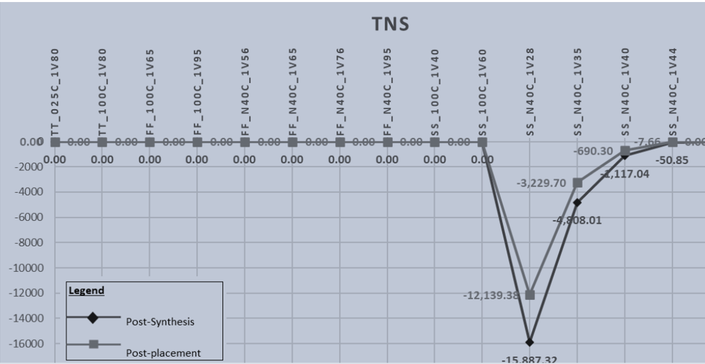
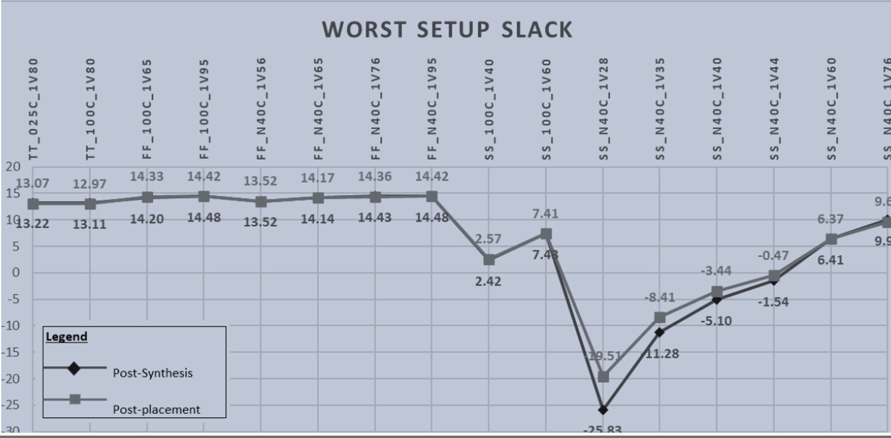
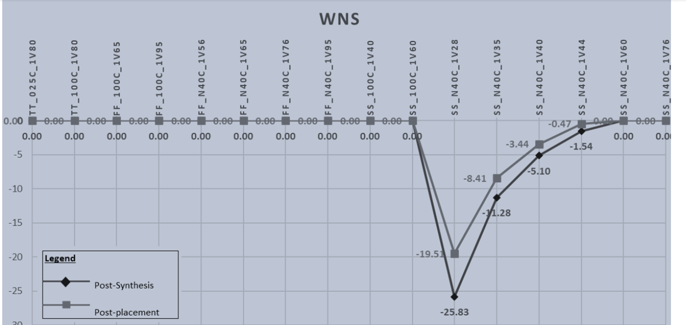
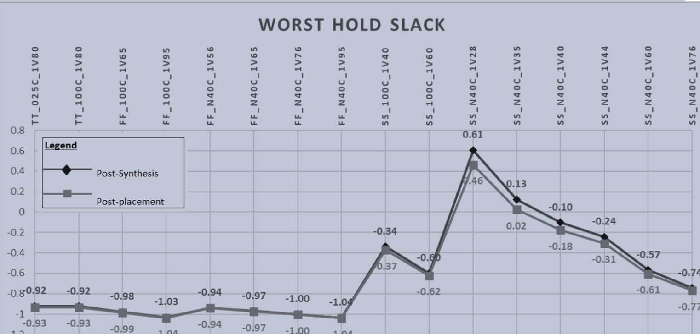
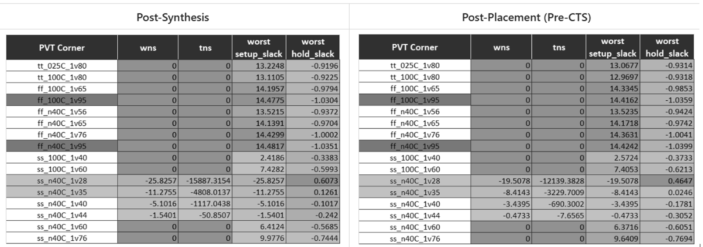

# Week 8 Task – Post-Layout STA & Timing Graphs Across PVT Corners for RoutedVSDBabySoC

## ObjectiveTo perform Post-Layout Static Timing Analysis (STA) using the SPEF generated afterrouting in Week 7, analyze timing across all PVT corners, and compare post-route resultswith post-synthesis timing data from Week 3

Post-layout STA with SPEF and multiple PVT corners is about recomputing all path delays using real extracted RC parasitics and corner-specific .lib data, then comparing these “realistic” slacks to the ideal post-synthesis numbers to judge tape-out readiness. This explains why Week 8 timing often differs significantly from Week 3 timing even though the logical netlist is the same.​

Static timing analysis basics
Static Timing Analysis (STA) checks whether every timing path in a design meets setup and hold constraints without running dynamic simulations. It uses:​

Gate/interconnect delay models from Liberty (.lib) libraries.

Structural connectivity from the gate-level netlist.

Constraints from SDC (clocks, I/O delays, false/multicycle paths).

For each path, STA computes:

Arrival time (AT): time when data reaches an endpoint.

Required time (RT): latest (for setup) or earliest (for hold) time allowed by clock constraints.

Slack=RT−AT for setup, and 
Slack=ATmin−RTmin
  for hold (sign convention can vary, but violation always means negative slack).​

PVT corners and timing behavior
PVT corners model fabrication and operating variations using different .lib files:

Process: TT (typical), SS (slow-slow), FF (fast-fast), sometimes more (SF, FS, etc.).​

Voltage: low Vdd (slower, worse setup) vs high Vdd (faster, more hold risk).

Temperature: high T (slower devices, often worst for setup) vs low T (faster devices, worst for hold).​

For setup checks, worst case is usually slow process, low Vdd, high T (e.g., SS, 1.6 V, 125°C).
For hold checks, worst case is usually fast process, high Vdd, low T (e.g., FF, 1.95 V, -40°C).​

In OpenSTA, corners are defined and linked to different .lib files, then STA is run for each corner, giving WNS/TNS and WHS/THS per corner.​

Role of SPEF and post-layout STA
Pre-layout (Week 3) STA uses ideal or estimated interconnect (often only cell internal delays and simple wire models), so delay is dominated by gate delays. After routing, an extractor generates a SPEF file that contains:​

Lumped and distributed RC values per net (capacitances to ground, coupling caps, resistive segments).

Connectivity of parasitic network (nodes and segments for each routed net).​

When SPEF is annotated in OpenSTA, the interconnect delay is recomputed using these RCs, making:

Long, high-fanout or congested nets much slower (larger Elmore delay).

Coupling capacitances alter effective capacitance and can cause additional delay or noise.

Thus, post-layout STA replaces simplistic wire models with SPEF-based RC networks, which often increases path delay and can reduce setup slack compared to post-synthesis.​

WNS, TNS, WHS, THS definitions
Across each corner and check type, tools summarize timing as:

WNS (Worst Negative Slack): most negative setup slack among all endpoints; if ≥ 0, setup is met everywhere at that corner.​

TNS (Total Negative Slack): sum of all negative setup slacks; indicates how many paths and how badly they are failing.

WHS (Worst Hold Slack): most negative hold slack (earliest-arrival violation); if ≥ 0, hold is clean.

THS (Total Hold Slack): sum of all negative hold slacks; measures aggregate hold problem size.​

Why post-route timing differs from pre-route
The logical connectivity is identical, but physical details change delays:

Added wire resistance and capacitance: routed nets are longer and narrower than the ideal, increasing RC delay and load on drivers.​

Coupling capacitance: dense routing introduces C between adjacent nets; tools often convert this into effective load or extra delay, worsening critical paths.

Clock-tree synthesis: CTS changes clock arrival times (skew, insertion delay), which shifts both setup and hold windows on all sequential elements.​

As a result:

Setup: WNS/TNS often degrade (become more negative) at slow corners after routing because data paths slow down more than clock paths, especially on long interconnects.

Hold: WHS/THS can improve or worsen; sharper and faster clock/data edges at fast corners, combined with skew changes, frequently create new hold violations on very short paths.​

Design optimizations in PD (buffer insertion, upsizing, re-routing) try to fix this by balancing:

Reducing long path delays (fix setup) via upsizing or buffering, which may hurt hold on short segments.

Adding delay elements or using smaller cells on very short paths (fix hold), which must not compromise setup at other corners.​

Timing graphs and multi-corner analysis
A timing graph models the circuit as:

Nodes: pins of cells and ports.

Edges: timing arcs (cell delays) and interconnect segments (wire delays with RC).

For each clock domain and corner, STA propagates early and late arrival times through the graph, then reports paths and slacks. When you “plot timing graphs” in Week 8 (like Day 26 examples), you are essentially visualizing:​

The critical or near-critical paths (edges with largest contributions to delay).

How the same logical path’s delay and slack change from TT to SS to FF because both cell delays (.lib) and net delays (SPEF) are corner-dependent.​

Physical effects and timing closure
SPEF-based post-layout STA exposes real physical effects that control whether the design is tape-out ready:

Interconnect RC: dominates delay at advanced nodes and for long global nets, making physical placement and routing crucial.​

Crosstalk / coupling: can increase effective delay or create noise-induced violations; sign-off flows often use advanced models, but even simple coupling reduction in OpenSTA shows its impact.

Voltage/temperature dependence: at different corners, cell drive strengths and wire resistivities change, so parasitic-limited paths can move between safe and violating depending on corner.

